\newpage

# Abstract
Recombinase polymerase amplification (RPA) enables rapid, isothermal DNA detection, but reliance on external heating (37–42°C) limits its deployment in point-of-care and field settings. Developing ambient-temperature RPA requires cold-adapted enzymes capable of efficient strand exchange at lower temperatures. Here, we report an integrated computational pipeline to identify candidate psychrophilic UvsX orthologs from genomic databases. Screening over 26,000 protein sequences using profile Hidden Markov Models and conserved ATP-binding motifs identified 1,498 high-confidence UvsX candidates. Candidates were evaluated using Seq2Topt machine learning, TMP a custom LLM-based literature retrieval pipeline, and molecular dynamics (MD) simulations. MD trajectories revealed distinct dynamic signatures among thermal classes, with psychrophilic candidates exhibiting elevated conformational flexibility. We prioritised three high-confidence candidates; UFK27161, YCB25778, and YCQ78089, that maintain structural stability alongside enhanced flexibility. All code, custom HMM profiles, and screening pipelines are publicly available on GitHub https://github.com/JDuarteNiemen/NAAT_artic_phages. 

# 1 Introduction

## 1.1 The Need For Portable DNA Diagnostics
Rapid nucleic acid detection is essential for clinical diagnostics, disease surveillance, and environmental monitoring. However, conventional molecular diagnostic workflows often require centralised laboratory infrastructure, specialised equipment, and trained personnel, limiting their deployment in field-based and resource-limited settings.

Portable diagnostic platforms address this by enabling molecular testing at the point of need, improving outbreak response and expanding diagnostic access beyond centralised laboratories, provided amplification methods can maintain high sensitivity with minimal equipment.

## 1.2 What Is Recombinase Polymerase Amplification (RPA)
Before nucleic acid amplification, infectious disease diagnosis relied on clinical symptoms, microscopy, immunological assays and culture-based methods, which often lacked accuracy or speed, or depended on successfully culturing the target organism. Polymerase chain reaction (PCR) addressed this and remains the gold standard, offering high sensitivity, specificity and robustness across diagnostic applications. However, PCR's dependence on repeated thermal cycling for denaturation, annealing and extension requires specialised thermocycling equipment, increasing assay complexity and restricting deployment in resource-limited or point-of-care settings, driving the development of alternative amplification methods that retain PCR's sensitivity with less equipment.

Recombinase polymerase amplification (RPA) is a rapid, highly sensitive isothermal DNA amplification method that enables nucleic acid detection without the need for thermal cycling or complex laboratory equipment (Piepenburg, 2006). By combining recombinase-mediated primer targeting with strand-displacing DNA polymerase activity, RPA achieves exponential amplification at low, constant temperatures and can detect very low concentrations of target DNA. These characteristics make RPA well suited for portable diagnostics and point-of-care applications, with the potential to overcome key limitations associated with conventional PCR-based testing.


### 1.2.1 How RPA works
Recombinase polymerase amplification (RPA) is an isothermal DNA amplification technique that combines recombinase-mediated primer targeting with strand-displacing DNA synthesis. A typical RPA reaction contains the recombinase UvsX, its loading factor UvsY, the single-stranded DNA-binding protein gp32, and a strand-displacing DNA polymerase (Piepenburg, 2006).

Single-stranded DNA primers are designed to flank the target region and anneal to opposite strands of the template DNA, with their 3' ends oriented toward the region to be amplified. In solution, gp32 binds strongly to single-stranded DNA, including primers, preventing premature secondary structure formation and nonspecific interactions. UvsY promotes the assembly of UvsX onto the primers by facilitating displacement of gp32 and stabilising the formation of ATP-bound UvsX–DNA nucleoprotein filaments as seen in figure 1.

These nucleoprotein filaments actively scan double-stranded DNA for homologous sequences through transient, ATP-dependent interrogation of short base segments. Upon identification of sufficient sequence complementarity, the filament promotes strand invasion, displacing the complementary strand and forming a displacement loop (D-loop). gp32 binds the displaced single strand, stabilising the intermediate and preventing branch migration-mediated dissociation.

ATP hydrolysis regulates UvsX filament dynamics, promoting disassembly after successful strand invasion and thereby exposing the primer 3' end. This allows a strand-displacing DNA polymerase (commonly the large fragment of Bacillus subtilis DNA polymerase I) to extend the primer. Repeated cycles of filament formation, strand invasion, and primer extension lead to exponential amplification of the target sequence under isothermal conditions (Lobato, 2018).


\begin{figure}[H]
\centering
\includegraphics[width=0.5\textwidth]{images/rpa_diagram.png}
\end{figure}
**Figure 1. Overview of recombinase polymerase amplification (RPA).** Schematic representation of the RPA mechanism. UvsX recombinase binds single-stranded primers and facilitates their invasion into homologous regions of double-stranded DNA. Following primer binding, strand displacement synthesis by polymerase enables rapid DNA amplification under isothermal conditions without the need for thermal cycling.

\newpage

### 1.2.2 RPA vs PCR comparison

+--------------------------------+--------------------------------+--------------------------------+
| Feature                        | Recombinase Polymerase         | Polymerase Chain Reaction      |
|                                | Amplification (RPA)            | (PCR)                          |
+================================+================================+================================+
| **Temperature requirement**    | Isothermal amplification       | Requires repeated thermal      |
|                                | performed at a constant low    | cycling between denaturation,  |
|                                | temperature (~37-42°C)         | annealing, and extension       |
|                                |                                | temperatures                   |
+--------------------------------+--------------------------------+--------------------------------+
|                                |                                |                                |
+--------------------------------+--------------------------------+--------------------------------+
| **Equipment requirements**     | Minimal equipment; can be      | Requires a specialised         |
|                                | performed using simple heating | thermocycler, limiting         |
|                                | devices, enabling portable and | portability                    |
|                                | point-of-care applications     |                                |
+--------------------------------+--------------------------------+--------------------------------+
|                                |                                |                                |
+--------------------------------+--------------------------------+--------------------------------+
| **Amplification speed**        | Rapid amplification, typically | Generally slower due to        |
|                                | producing detectable products  | multiple thermal cycling steps |
|                                | within ~20-40 minutes          |                                |
+--------------------------------+--------------------------------+--------------------------------+
|                                |                                |                                |
+--------------------------------+--------------------------------+--------------------------------+
| **Sensitivity**                | Highly sensitive and capable   | Highly sensitive, particularly |
|                                | of detecting low               | when combined with             |
|                                | concentrations of target       | quantitative PCR (qPCR)        |
|                                | nucleic acids                  |                                |
+--------------------------------+--------------------------------+--------------------------------+
|                                |                                |                                |
+--------------------------------+--------------------------------+--------------------------------+
| **Specificity**                | Can tolerate some              | Generally higher specificity   |
|                                | primer-template mismatches,    | due to strict primer annealing |
|                                | which may increase the risk of | requirements and controlled    |
|                                | non-specific amplification     | thermal cycling                |
+--------------------------------+--------------------------------+--------------------------------+
|                                |                                |                                |
+--------------------------------+--------------------------------+--------------------------------+
| **Quantification capability**  | Primarily qualitative or       | Excellent quantitative         |
|                                | semi-quantitative due to rapid | capability when using qPCR     |
|                                | amplification kinetics         | approaches                     |
+--------------------------------+--------------------------------+--------------------------------+
|                                |                                |                                |
+--------------------------------+--------------------------------+--------------------------------+
| **Primer design**              | Relatively simple but still    | Well-established primer design |
|                                | requires optimisation to       | principles and extensive       |
|                                | minimise non-specific          | optimisation tools available   |
|                                | amplification                  |                                |
+--------------------------------+--------------------------------+--------------------------------+
|                                |                                |                                |
+--------------------------------+--------------------------------+--------------------------------+
| **Applications**               | Point-of-care diagnostics,     | Clinical diagnostics, research |
|                                | field pathogen detection,      | applications, pathogen         |
|                                | environmental monitoring, and  | detection, and molecular       |
|                                | resource-limited settings      | biology workflows              |
+--------------------------------+--------------------------------+--------------------------------+

**Table 1.** Summary of the comparative advantages and limitations of recombinase polymerase amplification (RPA) and polymerase chain reaction (PCR).


### 1.2.3 Why Cold adapted orthologs would revolutionise DNA diagnostics.
Although RPA eliminates the need for thermal cycling, current reactions are typically performed at 37–42 °C to ensure optimal activity of the recombinase and polymerase enzymes. While this temperature is considerably lower than that required for PCR, it still necessitates an external heat source, limiting the deployment of RPA in truly equipment-free settings. Developing an RPA system capable of operating efficiently at ambient temperatures (approximately 20–25 °C) would therefore represent a significant advancement for point-of-care molecular diagnostics.

One potential strategy is identifying cold-adapted UvsX orthologs from psychrophilic organisms, whose adaptations for maintaining catalytic activity at low temperature (Section 1.4) may, if conserved in recombinases, allow efficient homology searching, strand invasion and primer targeting at room temperature without compromising amplification efficiency.

An ambient-temperature RPA system would further reduce the equipment requirements of nucleic acid amplification by removing the need for incubators or portable heating devices. This would simplify testing in resource-limited settings, facilitate field-based pathogen surveillance, improve environmental DNA (eDNA) monitoring, and enable rapid diagnostics during disease outbreaks where laboratory infrastructure is unavailable. Lower operating temperatures may also reduce power consumption, increase assay portability and simplify integration into disposable diagnostic devices.


## 1.3 UvsX
UvsX is a recombinase protein encoded by bacteriophage T4 that plays a central role in homologous recombination. The protein is 391 amino acids in length and belongs to the RecA-like family of ATP-dependent recombinases. UvsX is evolutionarily related to the bacterial recombinase RecA, sharing a common RecA-like structural fold and conserved functional regions involved in homologous recombination. Similar to RecA, UvsX forms ATP-dependent nucleoprotein filaments on single-stranded DNA (ssDNA), which mediate the search for homologous sequences within double-stranded DNA (dsDNA) and facilitate strand exchange.

Among the components of the RPA reaction, UvsX represents a particularly attractive target for optimisation because recombinase-mediated filament formation and strand invasion constitute the first rate-limiting steps of amplification. Improving UvsX activity under reduced thermal conditions could therefore increase the operational range of the entire reaction.

### 1.3.1 ATP binding domains
ATP hydrolysis controls the dynamic assembly and disassembly of UvsX-DNA filaments, so mutations affecting ATP-binding regions could alter recombinase activity and amplification efficiency. Two conserved motifs support this: the Walker A motif (P-loop), at residues 59–67, is the primary nucleotide-binding site and interacts with the phosphate groups of ATP; the Walker B motif, at residues 138–143, contains the catalytic Asp143 residue that coordinates the Mg$^{2+}$ ion required for hydrolysis (Gajewski, 2011). Conservation of both motifs and of the Walker A motif's position and composition relative to RecA, indicates that UvsX retains the ATP-dependent mechanism characteristic of RecA-like ATPases.

### 1.3.2 DNA binding loops
DNA binding requires conformational rearrangement of flexible loop regions, these regions may represent potential contributors to temperature-dependent changes in recombinase activity.

UvsX interacts with both ssDNA and dsDNA through conserved DNA-binding loops located within the core RecA-like domain. Despite relatively low sequence conservation between UvsX and RecA, the overall folding of the core domain is highly conserved, including the presence of two DNA-binding loops, L1 and L2. These flexible loops mediate interactions with DNA and are positioned to stabilise nucleic acid binding within the UvsX nucleoprotein filament. Structural studies of RecA-like recombinases suggest that these loops undergo conformational flexibility to accommodate DNA, with each UvsX monomer interacting with approximately three nucleotide or DNA base pairs (Pan, 2023).

The N-terminal and C-terminal regions of UvsX primarily contribute to oligomerisation and filament formation rather than directly contacting DNA. These domains interact with the core domain to stabilise the recombinase filament, creating the appropriate architecture for DNA binding and homologous pairing. Through coordinated action of the core DNA-binding loops and filament-forming regions, UvsX is able to bind ssDNA and facilitate homology searching against dsDNA during strand exchange (Ando, 1998).

\begin{figure}[H]
\centering
\includegraphics[width=0.5\textwidth]{images/uvsx_structure.png}
\end{figure}
**Figure 2. Crystal structure of the UvsX dimer highlighting the RecA-like ATPase domain and DNA-binding loops.** The dimeric arrangement of UvsX showing the conserved RecA-like core domain and the location of the ATP-binding sites at the dimer interface. The positions of the N- and C-terminal regions and the DNA-binding loops L1 and L2 are indicated, highlighting the structural organisation of the domains involved in ATP-dependent recombination and DNA binding.

## 1.4 Thermal Adaptation
Temperature is a fundamental determinant of protein function, influencing both the rate of biochemical reactions and the structural dynamics required for catalysis. As temperature decreases, molecular motion is reduced, resulting in fewer productive collisions between enzymes and their substrates and an increase in the energetic barriers associated with conformational change. Enzyme catalysis depends on the ability of proteins to undergo precise structural rearrangements that position catalytic residues, orient substrates correctly, and stabilise the high-energy transition state intermediate formed during a chemical reaction. By reducing the activation energy required to reach this transition state, enzymes accelerate reaction rates; therefore, reduced conformational flexibility at low temperatures can limit catalytic efficiency. Organisms inhabiting permanently cold environments have consequently evolved proteins that maintain sufficient flexibility and catalytic activity despite reduced thermal energy.

Protein thermal adaptation is governed by a fundamental trade-off between catalytic activity and structural stability. Thermophilic proteins maximise stability through extensive intramolecular interactions, including increased hydrophobic packing, hydrogen bonding, and salt bridge formation, enabling them to resist thermal unfolding at elevated temperatures. Maintaining a stable folded structure is essential because protein function depends on the precise three-dimensional arrangement of amino acid residues that form active sites and interaction surfaces. Thermal unfolding disrupts these structural features, resulting in loss of enzymatic activity and potentially irreversible aggregation. In contrast, psychrophilic proteins have evolved to favour catalytic efficiency over stability, allowing them to remain highly active at low temperatures through increased structural flexibility while becoming more susceptible to thermal denaturation. This activity–stability trade-off is considered a defining characteristic of enzyme thermal adaptation.

Early models attributed this increased activity to enhanced flexibility at the active site itself. However, comparative studies of psychrophilic, mesophilic and thermophilic citrate synthases challenged this view: activation thermodynamics differed as expected, but active-site residues showed little extra atomic fluctuation, and the reduction in activation enthalpy instead originated predominantly from regions outside the active site (Åqvist, 2017). This points to psychrophilic enzymes possessing altered conformational energy landscapes rather than simply more flexible active sites: structural adaptations such as reduced hydrophobic packing, fewer stabilising electrostatic interactions and subtle amino acid substitutions increase mobility in loops and domain interfaces distant from the catalytic centre, lowering the energetic cost of catalysis while the active site itself remains highly conserved and structurally competent.

These principles are particularly relevant to recombinase proteins such as UvsX. Unlike many metabolic enzymes, UvsX functions through a series of ATP-dependent conformational transitions that drive nucleoprotein filament assembly, homologous DNA searching, strand invasion, ATP hydrolysis and filament disassembly. The efficiency of these processes depends not only on the integrity of the ATP- and DNA-binding sites but also on coordinated structural dynamics throughout the protein. It is therefore plausible that cold-adapted UvsX orthologs have evolved modifications to their global conformational dynamics that permit efficient recombinase activity at lower temperatures without substantially altering the conserved functional regions responsible for ATP binding or DNA recognition.


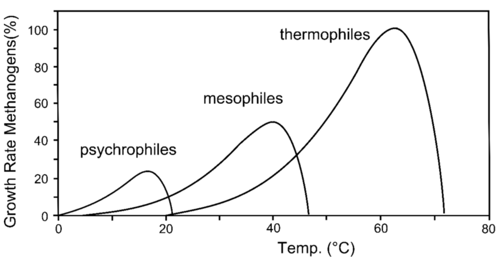
**Figure 3. Thermal ranges of organisms and associated protein adaptations.** Comparison of the environmental temperature ranges occupied by psychrophilic, mesophilic, and thermophilic organisms. Cold-adapted proteins from psychrophilic organisms exhibit structural adaptations that maintain catalytic activity and flexibility at reduced temperatures, providing a potential source of enzymes for low-temperature biotechnological applications.

## 1.5 Computational bioprospecting of UvsX orthologs
The rapid expansion of genomic and metagenomic datasets has enabled computational bioprospecting, where bioinformatic approaches are used to explore biological diversity and identify proteins with potentially valuable functional properties. By screening previously unexplored genetic resources, including extremophilic microbial communities, computational approaches provide a route to discovering novel biomolecules beyond experimentally characterised systems.

For the discovery of temperature-adapted UvsX recombinases, experimentally validated proteins provide essential references for identifying sequence and structural features associated with functional activity. The bacteriophage T4 UvsX recombinase represents the canonical member of this family due to its established role in homologous recombination and extensive biochemical characterisation. Additionally, the recently characterised UvsX$_t$ (7Z3M) and UvsX$_p$ (9GBG) orthologs, identified from extremophilic phages through the Virus-X project, demonstrate functional diversity across phage lineages while retaining conserved RecA-like ATPase and DNA-binding features (Tarrant, 2026).

Together, these characterised UvsX proteins provide reference points for computational pipelines designed to identify novel recombinases with potentially altered temperature adaptations. Comparing candidate sequences against experimentally validated examples enables the prioritisation of proteins with characteristics consistent with functional UvsX activity.

## 1.6 Current limitations of RPA
Although recombinase polymerase amplification (RPA) offers rapid amplification, high analytical sensitivity and minimal equipment requirements, several limitations currently restrict its widespread adoption. RPA tolerates primer-template mismatches, this increased mismatch tolerance reduces assay specificity. Consequently, background DNA present in complex biological samples may undergo unintended amplification, increasing the likelihood of false-positive results in diagnostic applications (Rohrman, 2015).

While RPA is generally more resistant to common PCR inhibitors and can therefore be applied to less purified samples, its performance is highly dependent on careful optimisation of reaction conditions. The amplification process relies on a coordinated interaction between the recombinase UvsX, the loading factor UvsY, gp32 single-stranded DNA-binding protein and a strand-displacing DNA polymerase. Small changes in enzyme concentration, primer design or reaction chemistry can significantly affect amplification efficiency and increase the risk of non-specific products (Oliveira, 2021).

Although primer design is simpler than in other isothermal amplification techniques such as loop-mediated isothermal amplification (LAMP), dedicated primer design software remains limited and assay optimisation is often empirical, however there have been recent progress made at the Emergent Bioinformatics Lab who have released PrimedRPA to address this issue (Higgins, 2019). Furthermore, unlike quantitative PCR (qPCR), RPA provides relatively poor quantitative discrimination because amplification begins almost immediately after the reaction is initiated, making precise quantification challenging. As a result, RPA is predominantly used as a qualitative or semi-quantitative diagnostic technique (Tan, 2022).

Practical considerations also limit wider implementation. Commercial RPA reagents remain relatively expensive owing to proprietary enzyme formulations, and fewer commercial kits are available compared with the extensive range of PCR assays. Consequently, despite its advantages of rapid amplification (typically within 20–40 minutes), low operating temperature (37–42 °C) and minimal equipment requirements, RPA has yet to achieve the widespread adoption of PCR in routine diagnostic laboratories.


## 1.7 Aims & Objectives
The development of ambient-temperature RPA requires the identification of recombinase enzymes capable of maintaining efficient DNA strand exchange under reduced thermal conditions. This project aims to identify and characterise cold-adapted UvsX orthologs with the potential to extend the operational temperature range of RPA-based DNA amplification.

To achieve this aim, the following objectives will be addressed:

1. Identify candidate cold-adapted UvsX orthologs from publicly available sequence databases.
    Experimentally validated UvsX sequences will be used as reference standards to discover putative orthologs across diverse phage and microbial lineages.
2. Develop an in silico screening pipeline to prioritise candidate UvsX proteins.
    Candidate sequences will be evaluated using profile-based and sequence-based approaches, including hidden Markov models (HMMs), alongside computational predictors of protein adaptation and thermal preference.
3. Evaluate the structural dynamics of candidate UvsX orthologs.
    Molecular dynamics simulations will be used to investigate protein flexibility, stability, and conformational behaviour, identifying structural characteristics associated with cold adaptation.

Together, these approaches aim to establish a computational framework for discovering cold-adapted UvsX enzymes and identifying promising candidates for future experimental validation in ambient temperature RPA systems.


\newpage
# 2 Methods

## 2.1 Selection of gold standard proteins
Experimentally characterised UvsX proteins were first identified to establish reference sequences for candidate discovery and downstream validation. These proteins provided experimentally supported examples of UvsX proteins with known functionality, thermal characteristics and available structural information.

The primary reference sequence was bacteriophage T4 UvsX, the recombinase utilised in conventional recombinase polymerase amplification (RPA). Additional validated UvsX orthologs were selected based on their experimentally characterised thermal adaptation properties. These included the thermophilic ortholog 7Z3M and the psychrophilic ortholog 9GBG (Tarrant, 2026).

Both orthologs were identified through metagenomic analysis as part of the Virus-X project, which aimed to characterise proteins recovered from extremophile environments. The thermophilic ortholog 7Z3M was isolated from a hot spring, whereas the psychrophilic ortholog 9GBG was recovered from marine sediments approximately 1,000 m below sea level, where the ambient temperature was approximately 0.5 °C.

An engineered K35G/E198R UvsX variant was also included as a representative directed-evolution-derived protein exhibiting enhanced catalytic activity (Zhang 2025). Other engineered variants from the same study were excluded to avoid overrepresentation of highly similar sequences differing only by individual amino acid substitutions.

The resulting set of four gold standard proteins was used to guide downstream sequence-based screening, including HMM construction, conserved motif identification and structural comparison.

## 2.2 Construction of a curated UvsX sequence database
A comprehensive database of candidate UvsX-like proteins was constructed using three publicly available protein resources: UniProt, NCBI, and InterPro. Candidate sequences were retrieved using database-specific search strategies designed to identify putative UvsX recombinase orthologs. For UniProt and NCBI, keyword-based searches were performed using terms associated with UvsX and phage recombinase proteins. To complement these searches, the two InterPro entries ("IPR049428", "IPR049047") associated with UvsX were queried through the InterPro API to retrieve all proteins annotated with the corresponding domains. All databases were queried in April 2026

For every retrieved sequence, the associated protein sequence and available metadata, including accession identifiers, organism information and taxonomic identifiers, were collected. Sequences obtained from each source were combined into a single candidate database before undergoing a series of curation and filtering steps to identify high-confidence UvsX orthologs.

## 2.3 Sequence database curation and redundancy removal
The combined database was first curated to remove redundant entries while preserving biologically meaningful diversity. Duplicate accession identifiers were removed to ensure that each database record was represented only once.

To further reduce redundancy, protein sequences were grouped according to amino acid identity. Within each group, taxonomic identifiers were used to distinguish proteins originating from the same species from those originating from different species. Where identical sequences originated from the same species, only a single representative sequence was retained. Identical sequences originating from different species were preserved to maintain taxonomic and evolutionary diversity for downstream analyses.

The resulting non-redundant sequence set was subsequently subjected to sequence quality filtering.

## 2.4 Sequence length filtering
Following redundancy removal, candidate proteins were filtered based on sequence length to remove likely annotation artefacts and incomplete protein models. The filtering thresholds were selected relative to the experimentally characterised T4 UvsX recombinase, which consists of 391 amino acids.

Proteins shorter than 326 amino acids or longer than 426 amino acids were excluded from further analysis. This range was selected to retain proteins comparable in size to characterised UvsX recombinases while reducing the inclusion of incomplete or incorrectly annotated sequences.


## 2.5 Identification of candidate UvsX orthologs using profile- and motif-based screening
A multi-stage screening framework was developed to identify high-confidence UvsX orthologs from the curated sequence database. Candidate proteins were evaluated using a combination of Hidden Markov Models (HMMs) and conserved ATP-binding motif identification.

### 2.5.1 Hidden Markov model construction
Three Hidden Markov Models (HMMs) were constructed using HMMER3 (HMMER 3.4) (Eddy, 2009).

The first HMM was generated from the curated Pfam (Sonnhammer, 1998; Mistry, 2021) seed alignment corresponding to the conserved UvsX ATPase domain (PF00154) using the `hmmbuild` function.

Two custom HMMs were generated using experimentally characterised UvsX proteins. The first was constructed from a multiple sequence alignment of the four gold standard proteins. The second was generated by identifying the conserved Pfam domain regions within the gold standard proteins, extracting these regions, aligning them, and constructing a profile HMM from the resulting alignment.

Each HMM was used to search the filtered sequence database using `hmmsearch`, and significant matches were retained for downstream candidate evaluation.

### 2.5.2 Conserved ATP-binding motif identification
In addition to profile-based screening, candidate proteins were assessed for the presence of conserved ATP-binding motifs characteristic of RecA-family recombinases.

The Walker A motif was identified using a regular expression representing the conserved P-loop nucleotide-binding motif. To accommodate sequence variation within UvsX proteins, the search pattern was adapted to account for the phenylalanine residue present within the T4 UvsX motif:

```
Gxxxx[G/F]K[T/S]
```

The Walker B motif was identified using the conserved hydrophobic residue pattern:

```
hhhh[D/E]
```

where *h* represents any hydrophobic amino acid.

DNA-binding regions were not included within the screening framework due to the absence of a conserved sequence motif and their predominantly structural mode of conservation. Instead, conserved ATP-binding motifs were used as functional sequence markers to increase confidence that identified candidates possessed the molecular features required for UvsX recombinase activity.


## 2.6 Prediction of protein thermal optima
Predicted optimal temperatures (Topt) were generated using Seq2Topt (v1.0.0), an ab initio machine learning model that predicts enzyme thermal optima directly from amino acid sequence information (Qiu, 2025).
Predictions were generated for high-confidence candidate sequences identified through the scoring framework.
These predictions were subsequently used alongside literature-derived thermal classifications to investigate relationships between sequence-derived thermal predictions and experimentally reported thermal adaptations.


## 2.7 Phylogenetic analysis
Phylogenetic analysis was performed to investigate evolutionary relationships between candidate sequences and experimentally characterised UvsX proteins.
Selected candidate sequences were aligned using multiple sequence alignment. MAFFT was initially evaluated for sequence alignment; however, due to computational limitations associated with the dataset size, FAMSA was used for large-scale alignment generation.
Resulting alignments were filtered using trimAl to remove low-confidence alignment regions prior to downstream phylogenetic analysis.

Although the resulting phylogeny provided an overview of sequence relationships, it did not yield sufficient biological insight to inform candidate prioritisation beyond the sequence-based screening framework. Consequently, downstream analyses focused on the high-confidence candidates identified through the combined HMM and conserved motif screening approach.


## 2.8 Agentic literature retrieval and thermal classification pipeline
While Seq2Topt provides ab-initio thermal predictions, experimentally validated evidence describing protein thermal adaptation remains scattered throughout the scientific literature. To integrate this evidence into the discovery pipeline, the Thermophile–Mesophile–Psychrophile (TMP) classification pipeline was developed to identify experimentally reported evidence describing the thermal adaptation of candidate proteins and their associated host organisms. The software, built in Python using LangGraph and Ollama, derives its name from the three thermal adaptation classes it predicts: thermophile, mesophile and psychrophile.

The workflow accepts NCBI protein accession identifiers as input and automatically retrieves associated metadata from NCBI resources. Metadata extracted includes protein annotations, organism information, taxonomic identifiers and linked scientific publications. Where available, publications directly associated with the queried protein accession are retrieved from PubMed and PubMed Central for analysis. If insufficient literature is associated with the accession, an additional literature search is automatically performed using a search query generated from the available protein and organism metadata to identify further relevant publications. In parallel, the pipeline performs organism-level analysis by identifying the source organism of each protein and retrieving publications associated with the host organism to provide additional evidence for thermal classification.

Retrieved literature is processed using large language models to identify experimentally reported growth temperatures, environmental conditions and other evidence indicative of thermal adaptation. Depending on the pipeline implementation, this evidence is analysed either directly from individual publications or after an intermediate evidence synthesis stage. The extracted information is subsequently used to assign each protein to one of three thermal adaptation classes: psychrophilic, mesophilic or thermophilic.

To evaluate the effectiveness of different agentic reasoning strategies, a benchmark dataset was constructed comprising protein accession identifiers from bacteriophages with experimentally established thermal adaptations. Organisms were selected through manual literature curation to represent psychrophilic, mesophilic and thermophilic phages, and representative protein accession identifiers from these organisms were compiled into a labelled validation dataset. This benchmark enabled quantitative comparison of multiple pipeline architectures against known thermal classifications.

Three iterative versions of TMP were developed and evaluated during software development. 

All software development, testing and benchmarking were performed on an Apple MacBook Pro equipped with an Apple M4 Pro processor and 48 GB of unified memory.

\newpage

### 2.8.1 Fast implementation
The Fast implementation prioritised computational efficiency by terminating literature analysis once the first sufficiently convincing piece of evidence supporting a thermal classification was identified. To maximise the likelihood of analysing informative publications first, retrieved papers were ranked using a regular expression-based scoring system that counted the occurrence of predefined thermal adaptation keywords (e.g. psychrophilic, thermophilic, growth temperature, optimal temperature). Publications containing a greater number of matching terms were prioritised for analysis by the language model. While this substantially reduced inference time and computational cost, classifications remained dependent on a single publication and were therefore more susceptible to misleading, incomplete or contradictory evidence.

\begin{figure}[H]
\centering
\includegraphics[width=0.5\textwidth]{images/FastGraph.png}
\end{figure}
**Figure 4. Workflow of the Fast implementation.** ClassifyThermalMetadata attempts to classify the thermal range of the protein using NCBI metadata associated with the accession. CreateAccessionLibrary retrieves and stores literature associated with the accession. ClassifyThermalLiterature ranks the retrieved papers using a regular expression of thermal related keywords and iterates through the ranked papers to identify a thermal range classification. ClassifyHostMetadata attempts to classify the host bacterium using metadata associated with the accession. ClassifyHostLiterature ranks papers using a regular expression of host-related keywords and iterates through the ranked papers to identify the host bacterium. CreateHostLibrary retrieves and stores literature associated with the identified host bacterium. ClassifyThermalRangeHostLiterature ranks the papers in the host literature library using a regular expression of thermal related keywords and iterates through the ranked papers to identify the thermal range of the host bacterium. ClassifyThermalForced provides a fallback thermal range classification using metadata when no classification has been obtained from the preceding steps. 

\newpage

### 2.8.2 Democratic implementation
The Democratic implementation sought to improve robustness by independently analysing each retrieved publication associated with a protein or host organism. As with the Fast implementation, publications were first ranked using the regular expression-based keyword scoring system to prioritise the most informative literature. Each publication generated an independent thermal classification, with every paper contributing one vote towards the final prediction. The overall thermal classification was then determined using majority voting across all analysed publications. This approach reduced the influence of individual erroneous classifications while allowing conflicting evidence within the literature to be represented during decision making.

\begin{figure}[H]
\centering
\includegraphics[width=0.4\textwidth]{images/DemocraticGraph.png}
\end{figure}
**Figure 5. Workflow of the Democratic implementation.** CreateAccessionLibrary retrieves and stores literature associated with the accession. ClassifyHostMetadata attempts to classify the host bacterium using metadata associated with the accession. ClassifyHostLiterature iterates through the literature associated with the accession and attempts to classify the host bacterium when this information was not obtained from metadata. CreateHostLibrary retrieves and stores literature associated with the identified host bacterium. ClassifyThermalMetadata attempts to classify the thermal range from metadata and records the result as a vote for Thermophile, Mesophile, Psychrophile, or None. ClassifyThermalLiterature iterates through the accession-associated literature and records each thermal range classification as a vote towards the final classification. ClassifyThermalRangeHostLiterature iterates through the host-associated literature and records each thermal range classification as a vote towards the final classification. ClassifyThermalForced provides a final forced thermal range classification from metadata, ensuring that at least one thermal range vote is available. The classification receiving the highest number of votes is returned as the final thermal range classification.  


### 2.8.3 Summary implementation
The final Summary implementation adopted a hierarchical reasoning strategy. Unlike the previous implementations, retrieved publications first underwent an automated relevance assessment to remove articles that contained little or no information relating to thermal adaptation. Relevant publications were then synthesised into a structured evidence summary describing the collective thermal characteristics reported across the literature. A final thermal classification was subsequently generated from this consolidated summary rather than from individual publications. By reasoning over an integrated body of evidence instead of isolated studies, this approach aimed to reduce inconsistencies arising from individual papers while enabling the language model to consider the complete evidence base before assigning a classification.


\begin{figure}[H]
\centering
\includegraphics[width=0.4\textwidth]{images/SummaryGraph.png}
\end{figure}
**Figure 6. Workflow of the Summary implementation.** CreateAccessionLibrary retrieves and stores literature associated with the accession. ClassifyHostMetadata attempts to classify the host bacterium using metadata associated with the accession. ClassifyHostLiterature iterates through the literature associated with the accession and attempts to classify the host bacterium when this information was not obtained from metadata. CreateHostLibrary retrieves and stores literature associated with the identified host bacterium. FilterRelevantLiterature and FilterRelevantHostLiterature evaluate the accession-associated and host-associated literature, respectively, and retain papers containing information relevant to thermal range classification. SummariseLiterature iterates through the relevant papers and summarises the available information, combining the summaries into a single text file. ClassifySummary attempts to classify the thermal range of the protein based on the summarised literature. ClassifyThermalForced provides a fallback thermal range classification using metadata when a classification cannot be obtained from the literature or has not otherwise been established.

The performance of each pipeline architecture was evaluated using the curated benchmark dataset, allowing the effect of different agentic reasoning strategies on thermal classification accuracy to be assessed. Literature-derived classifications were subsequently compared with sequence-based thermal predictions generated by the machine learning pipeline to determine the degree of agreement between evidence-based and sequence-based approaches. Together, these complementary analyses provided increased confidence in candidate selection by integrating experimental evidence from the scientific literature with computational predictions derived from protein sequence.


## 2.9 Protein structure prediction and structural comparison
Structural models were generated for selected UvsX proteins using Boltz (v2.2.1) (Passaro, 2025). Structural prediction was performed using amino acid sequences as input, with additional multiple sequence alignments supplied where appropriate.

Experimentally determined crystal structures of the gold standard proteins were used as structural references. Prior to structural comparison and molecular dynamics simulations, crystal structures were processed using PDBFixer (v1.12) to repair incomplete structural information, including missing residues and atoms, and to generate complete models suitable for downstream analyses.

To investigate strategies for improving Boltz structural predictions, several sequence preparation approaches were evaluated. These included predictions generated from full-length protein sequences and trimmed sequences corresponding to experimentally resolved structural regions. Multiple sequence alignments generated from UniRef100 using ColabFold (v1.6.2), as well as custom alignments generated from high-confidence UvsX orthologs identified during the in silico screening workflow, were supplied as additional inputs to Boltz where appropriate (Mirdita, 2022).

Predicted structures were compared with experimentally determined crystal structures using US-align (Version 20241108) to assess structural similarity (Zhang, 2022). AlphaFold-predicted structures were generated for the same proteins and evaluated using the same structural comparison workflow to benchmark prediction accuracy and identify the most suitable structural models for downstream molecular dynamics simulations (Abramson, 2024).


## 2.10 Molecular dynamics simulations
Molecular dynamics (MD) simulations were performed using GROMACS to investigate the structural stability and conformational dynamics of representative UvsX proteins (Van Der Spoel, 2005).

Experimentally determined crystal structures of the gold standard proteins were simulated to provide reference trajectories for comparison. In addition, representative psychrophilic, mesophilic, and thermophilic UvsX orthologs identified through the Thermal Metadata Pipeline (TMP) were selected for simulation. Structural models for these orthologs were obtained from AlphaFold and prepared for molecular dynamics simulations. The K35G/E198R was not simulated due to high similarity to UvsX. 

This research utilised Queen Mary's Apocrita HPC facility, supported by QMUL Research-IT. (T. King, 2016)

### 2.10.1 System preparation
Protein topologies were generated using the CHARMM27 force field with the TIP3P water model. Each protein was placed within a dodecahedral simulation box with a minimum distance of 1.0 nm between the protein and the box boundary. Systems were solvated, neutralised using potassium and chloride ions, and adjusted to a final ionic concentration of 0.10 M, to mimic RPA reaction conditions.

### 2.10.2 Energy minimisation
Energy minimisation was performed using the steepest descent algorithm with a convergence criterion of 1000 kJ mol$^{-1}$ nm$^{-1}$ and a maximum of 500 minimisation steps before equilibration.

### 2.10.3 Equilibration
Following minimisation, each system underwent sequential NVT and NPT equilibration.

Simulations were performed under three temperature conditions representing different thermal adaptation environments:

- Psychrophilic: 288K / 14.85$^o$C
- Mesophilic: 310K / 36.85$^o$C
- Thermophilic: 338K / 64.85$^o$C

Temperature, pressure and system density were monitored throughout equilibration to confirm system stability before production simulations.

### 2.10.4 Production molecular dynamics simulations
Production molecular dynamics simulations were performed using the equilibrated structures under the corresponding temperature conditions. Simulations were executed with a time step of 2 fs for 5,000,000 steps, yielding a total trajectory duration of 10,000 ps (10 ns) per run.

### 2.10.5 Trajectory analysis
Simulation trajectories were processed to remove periodic boundary artefacts before analysis. Structural stability and protein dynamics were characterised using:

- Root mean square deviation (RMSD)
- Root mean square fluctuation (RMSF)
- Radius of gyration (Rg)

These analyses were used to compare the structural stability and dynamic behaviour of the reference proteins and candidate UvsX orthologs under different thermal conditions.


\newpage

# 3 Results

## 3.1 Identification of UvsX orthologs from sequence databases

### 3.1.1 Construction of the curated UvsX sequence dataset

Initial database searches across UniProt, NCBI and InterPro retrieved a total of 26,486 candidate protein sequences. Removal of duplicate accessions and redundant protein sequences reduced the dataset to 20,550 unique sequences.

Examination of the sequence length distribution revealed substantial variation in protein length, with numerous sequences considerably shorter or longer than experimentally characterised UvsX recombinases (Figure 7). These proteins were likely to represent incomplete protein models, annotation artefacts or non-UvsX orthologs and were therefore excluded from further analysis using the predefined length filter of 326–426 amino acids.

Application of the sequence length filter reduced the dataset to 5,159 candidate proteins suitable for downstream screening.

The taxonomic composition of the dataset before and after sequence length filtering is shown in Figures 8 and 9. Although the total number of sequences was substantially reduced, the filtered dataset retained broad taxonomic diversity across bacteriophage families, including Straboviridae, the family containing the experimentally characterised T4 UvsX protein. This indicates that the filtering strategy removed likely artefactual sequences while preserving biologically relevant diversity of UvsX orthologs.


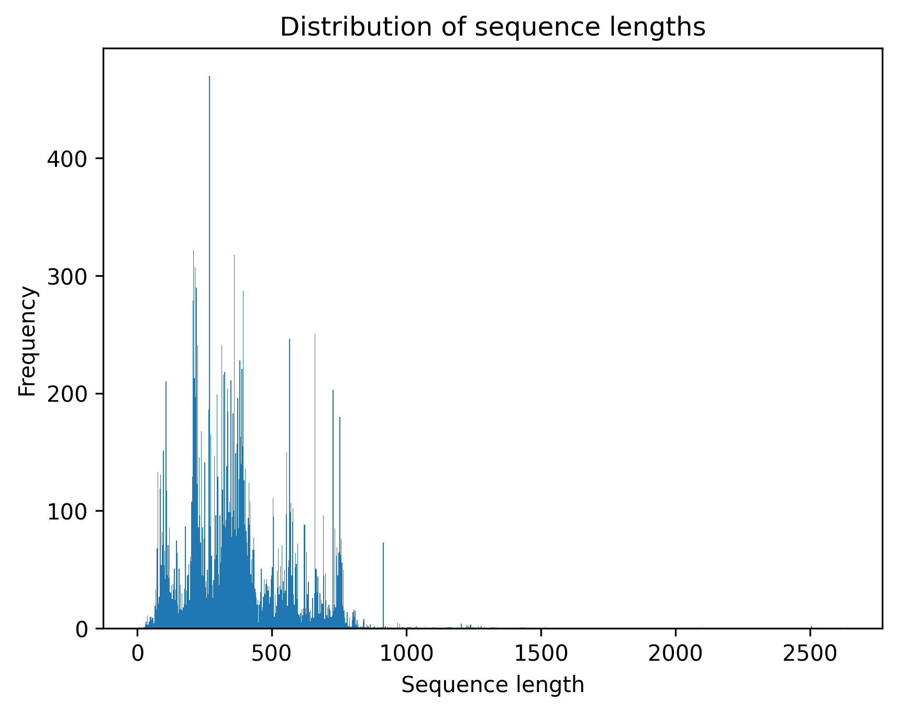


**Figure 7.** Distribution of protein sequence lengths following redundancy removal. The sequence length distribution was used to identify proteins comparable in size to experimentally characterised UvsX recombinases, with sequences outside the 326–426 amino acid range excluded during downstream filtering.

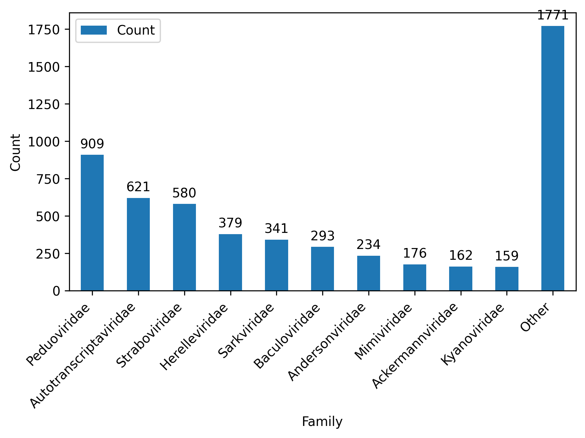

**Figure 8.** Taxonomic family distribution of proteins in the curated sequence database prior to sequence length filtering.


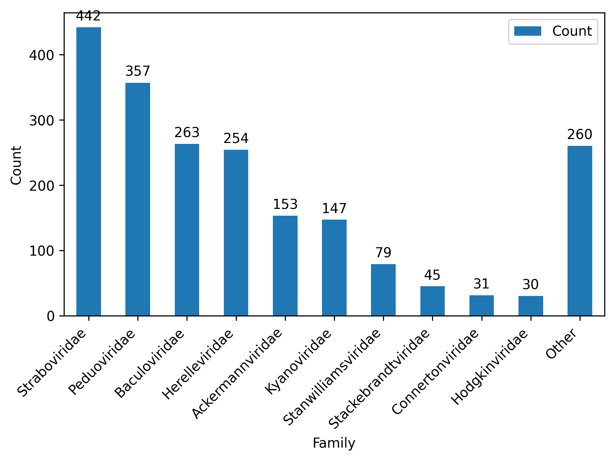


**Figure 9.** Taxonomic family distribution of proteins in the curated sequence database following sequence length filtering.


### 3.1.2 HMM-based identification of UvsX candidates

The filtered sequence dataset was screened using the three Hidden Markov Models constructed from experimentally characterised UvsX proteins and the conserved Pfam ATPase domain.

A total of 2,501 proteins matched all three Hidden Markov Models and were retained for subsequent motif-based screening. The overlap between the three HMMs is shown in Figure 10. The large intersection between all three models demonstrates substantial agreement between independently generated HMM profiles and supports their effectiveness for identifying conserved UvsX orthologs.


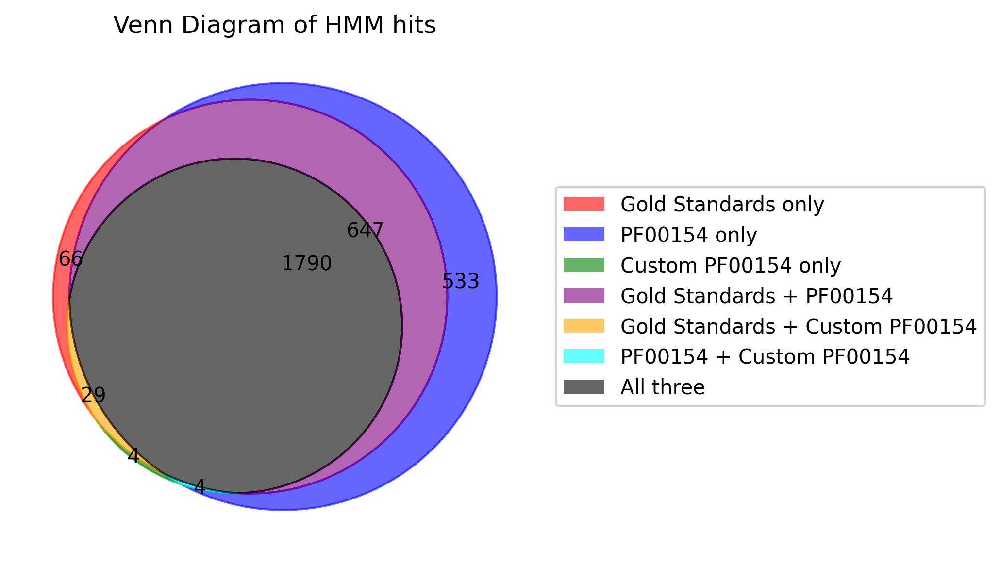

**Figure 10. Venn diagram showing the overlap between proteins identified in the curated database by the three Hidden Markov Models (HMMs).** Proteins retained for downstream analysis were required to be identified by all three HMM profiles.


### 3.1.3 Motif-based validation of candidate UvsX proteins

The 2,501 proteins identified through HMM screening were subsequently assessed for the presence of the conserved Walker A and Walker B ATP-binding motifs.

Application of the motif-based screening criteria reduced the candidate dataset to 1,498 proteins. These proteins satisfied every stage of the screening framework, including sequence length filtering, all three Hidden Markov Models and both conserved ATP-binding motif requirements.

The resulting dataset represents a high-confidence collection of putative UvsX orthologs that was used for all downstream thermal prediction, literature analysis, structural modelling and molecular dynamics simulations.


### 3.1.4 Characteristics of the final high-confidence UvsX dataset

The final high-confidence dataset comprised 1,498 candidate UvsX proteins spanning a broad range of bacteriophage families (Figure 11). Despite the stringent filtering strategy, substantial taxonomic diversity was retained, demonstrating that the screening framework was capable of identifying UvsX orthologs across diverse evolutionary lineages.

The sequence length distribution of the final candidates was consistent with experimentally characterised UvsX proteins, with the majority of proteins falling within the expected size range (Figure 12). This confirms that the combined filtering strategy successfully enriched for proteins possessing the characteristic sequence features of UvsX recombinases while removing likely annotation artefacts and unrelated ATPase proteins.


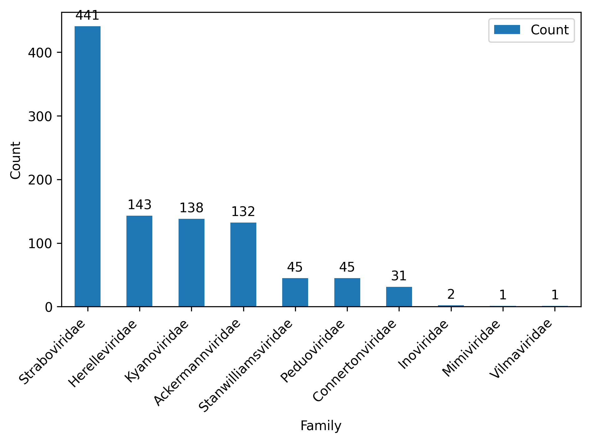


**Figure 11.** Taxonomic family distribution of the 1,498 high-confidence UvsX candidate proteins.


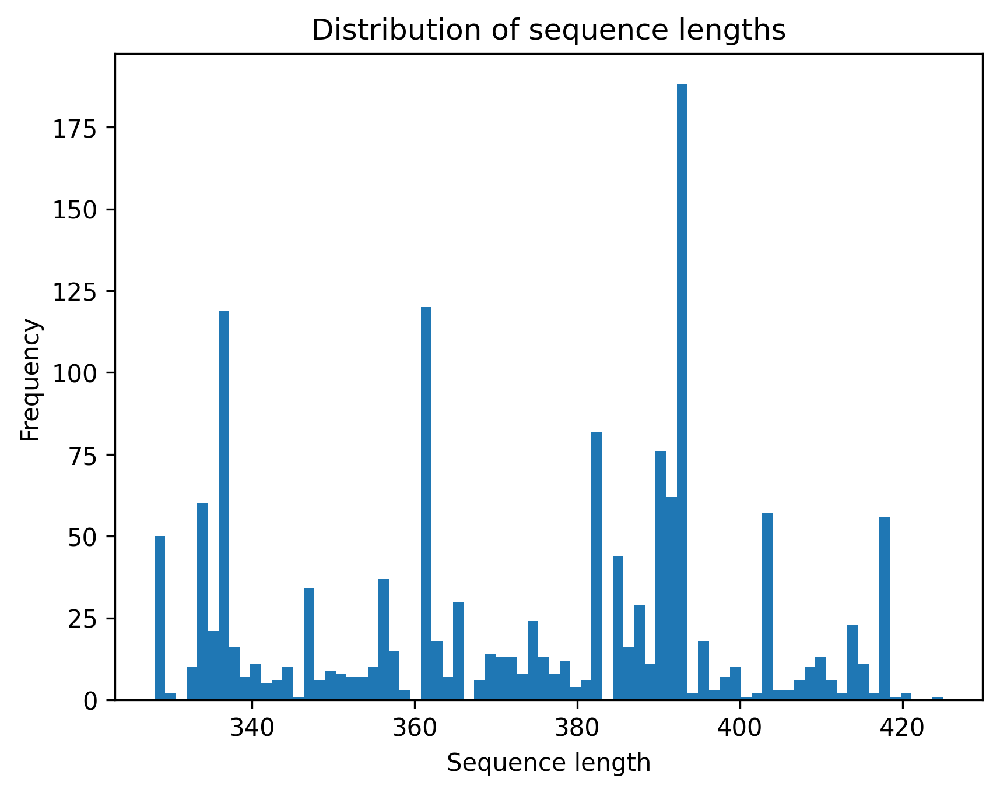


**Figure 12.** Sequence length distribution of the final high-confidence UvsX candidate dataset.

### 3.1.5 Candidate selection
The complete database construction and candidate selection pipeline is summarised in Figure 13, illustrating the progressive reduction from over 26,000 initially retrieved protein sequences to the final high-confidence dataset used for thermal prediction, literature-based thermal classification, structural modelling and molecular dynamics simulations.


**Figure 13.** Computational workflow used to construct the curated UvsX database and identify high-confidence candidate orthologs. Candidate proteins were retrieved from UniProt, NCBI and InterPro before undergoing redundancy removal, sequence length filtering, Hidden Markov Model screening and conserved motif identification. Proteins satisfying all screening criteria were retained for downstream analyses.

## 3.2 Thermal prediction and classification of candidate UvsX proteins

### 3.2.1 Seq2Topt predicted thermal optima

Predicted optimal temperatures (Topt) were generated for all 1,498 high-confidence UvsX candidates using Seq2Topt. Predicted temperatures ranged from 30°C to 80°C, with a mean predicted optimal temperature of 43.1°C (Figure 14).

The distribution of predicted temperatures was centred around mesophilic conditions, with comparatively fewer candidates predicted to exhibit extreme psychrophilic or thermophilic thermal optima. This suggests that the majority of identified UvsX proteins are predicted to function within moderate temperature environments.


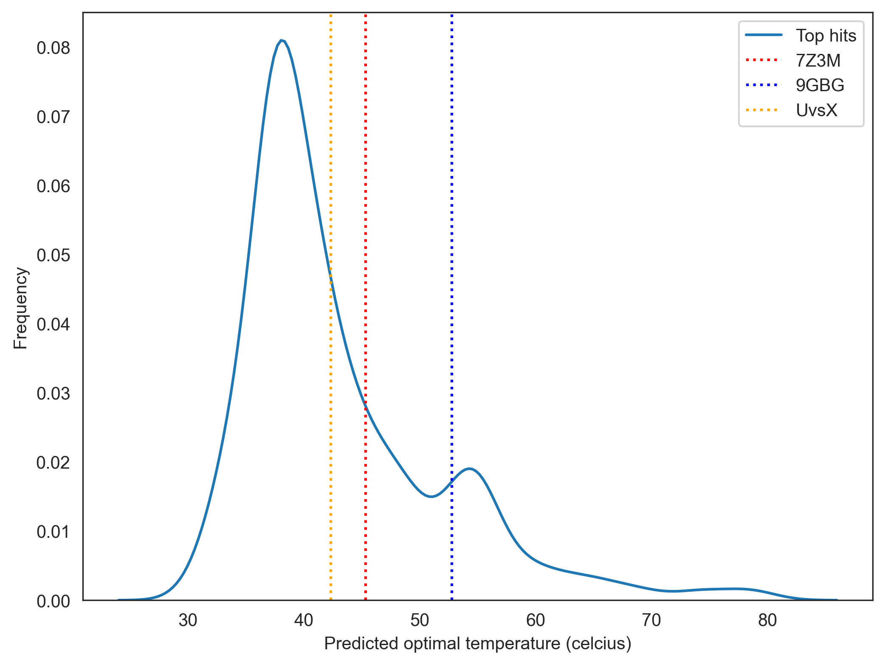

**Figure 14.** Distribution of Seq2Topt-predicted optimal temperatures for the 1,498 high-confidence UvsX candidate proteins. Experimentally characterised reference UvsX proteins are indicated for comparison, the psychrophilic UvsX protein 9GBG (Blue), the thermophilic UvsX protein 7Z3M (Red), and the mesophilic T4 UvsX protein (Orange).

To assess the suitability of Seq2Topt for predicting UvsX thermal adaptation, predictions for experimentally characterised reference proteins were compared with their known thermal characteristics. The thermophilic and psychrophilic reference proteins were predicted to have optimal temperatures of 46°C and 52°C, respectively, despite representing opposite extremes of thermal adaptation. 

These observations are consistent with the reported performance of Seq2Topt, which has a published root mean square error of 12.26°C and R² of 0.57. The limited separation between experimentally characterised psychrophilic and thermophilic UvsX proteins indicated that sequence-based prediction alone was insufficient for reliable thermal classification. Consequently, the Thermophile–Mesophile–Psychrophile (TMP) pipeline was developed to investigate whether integrating experimentally reported evidence from the scientific literature could improve classification of protein thermal adaptation.


### 3.2.2 Thermal classification using TMP
To evaluate the performance of the Thermophile–Mesophile–Psychrophile (TMP) pipeline, a benchmark dataset comprising 60 proteins with experimentally established thermal adaptations was assembled.

The benchmark dataset consisted of 20 psychrophilic, 20 mesophilic, and 20 thermophilic proteins, providing a balanced dataset for evaluating classification performance across the three thermal adaptation classes.

The curated benchmark dataset was subsequently used to compare the performance of the Fast, Democratic and Summary implementations of TMP.

| Thermal classification | Number of proteins |
|------------------------|-------------------:|
| Psychrophilic          | 20 |
| Mesophilic             | 20 |
| Thermophilic           | 20 |
| **Total**              | **60** |

**Table 2.** Composition of the benchmark dataset used to evaluate the performance of the TMP thermal classification pipeline.


### 3.2.3 Comparison of TMP implementations

Three versions of the Thermophile–Mesophile–Psychrophile (TMP) pipeline were evaluated using the 60-protein benchmark dataset: Fast, Democratic and Summary.

The three implementations differed primarily in the amount of literature evidence incorporated before generating a final thermal classification. The Fast implementation prioritised computational efficiency by terminating analysis once sufficient evidence was identified. The Democratic implementation incorporated classifications from multiple publications using majority voting. The Summary implementation performed an intermediate evidence synthesis step before generating the final classification.

The computational time required to classify all 60 benchmark proteins differed substantially between the three approaches (Figure 15). The Fast implementation required the shortest runtime, while the Summary implementation required the greatest computational time due to the additional literature processing and evidence synthesis steps.


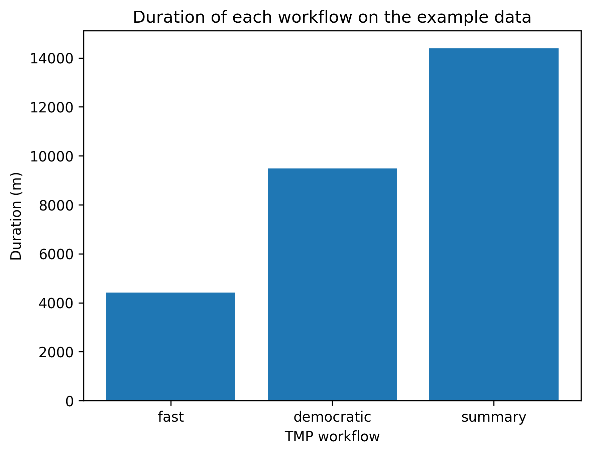

**Figure 15. TMP duration** Total runtime required, in minutes, for each TMP implementation to classify the 60 benchmark proteins.

Classification performance was assessed using accuracy, precision, recall and F1-score. Across all three approaches, thermophilic proteins were classified with high confidence, whereas greater variation was observed between mesophilic and psychrophilic classifications.

#### 3.2.3.1 Fast TMP

The Fast implementation achieved an overall classification accuracy of 78% across the benchmark dataset (Figure 16). Thermophilic proteins were classified correctly in all cases (recall = 1.00), while psychrophilic proteins showed reduced recall (0.40), with several proteins incorrectly classified as mesophilic.

Although structured output constraints were implemented to restrict model responses to the predefined thermal classification categories, occasional invalid classifications were still generated during inference. These outputs required post-processing before evaluation, demonstrating the importance of additional validation steps when applying automated literature-based classification workflows.


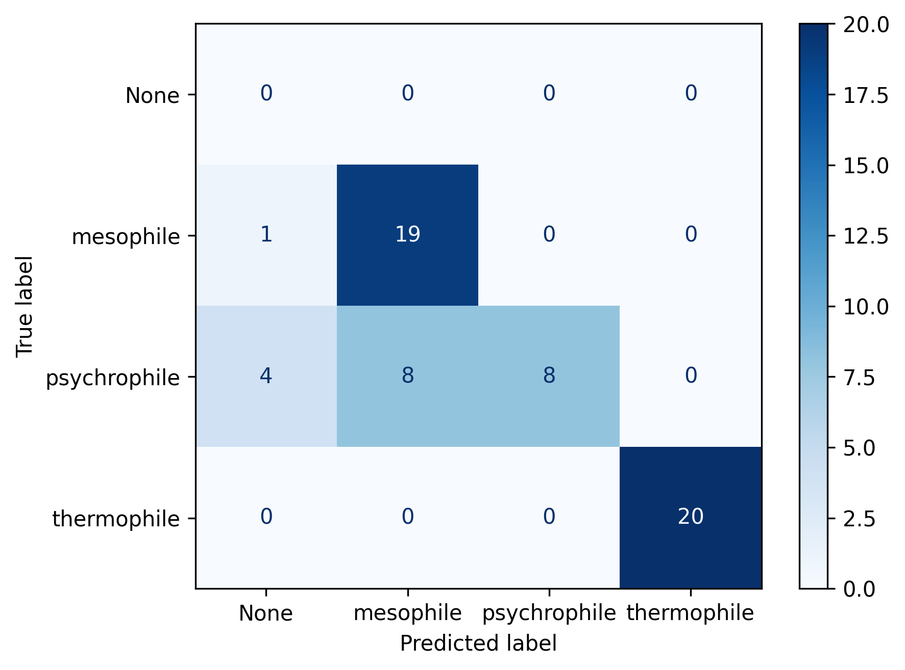
**Figure 16.** Confusion matrix showing classification performance of the Fast TMP implementation on the benchmark dataset.

\newpage

#### 3.2.3.2 Democratic TMP

The Democratic implementation improved overall classification accuracy to 80% (Figure 17). Similar to the Fast implementation, all thermophilic proteins were correctly identified, while psychrophilic proteins remained the most challenging class, with a recall of 0.40.

The increase in accuracy compared with the Fast implementation suggests that incorporating evidence from multiple publications reduced some classification errors. However, the persistence of misclassification between psychrophilic and mesophilic proteins indicated that majority voting alone was insufficient to fully resolve conflicting literature evidence.


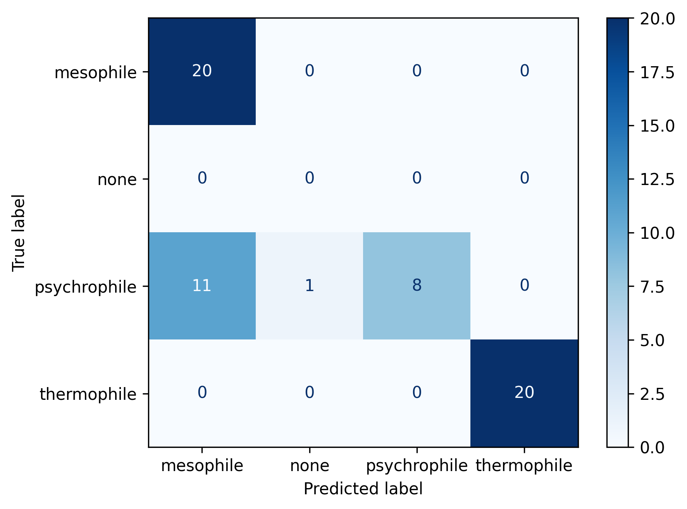
**Figure 17.** Confusion matrix showing classification performance of the Democratic TMP implementation on the benchmark dataset.

\newpage

#### 3.2.3.3 Summary TMP

The Summary implementation achieved the highest classification performance, with an overall accuracy of 90% (Figure 18). Thermophilic proteins were classified correctly in all cases (recall = 1.00), while psychrophilic and mesophilic classifications also improved compared with the previous approaches.

The largest improvement was observed for psychrophilic proteins, where recall increased from 0.40 in both the Fast and Democratic implementations to 0.70 in the Summary implementation. This suggests that summarising evidence across multiple publications before classification reduced errors arising from individual conflicting studies. Additionally, the invalid classification outputs observed during the Fast and Democratic implementations were no longer observed in the Summary approach, indicating improved compliance with the predefined classification categories following evidence synthesis.

Despite requiring the longest runtime, the Summary implementation provided the most accurate and consistent classification performance and was therefore selected as the final TMP workflow for downstream analysis of candidate UvsX proteins.


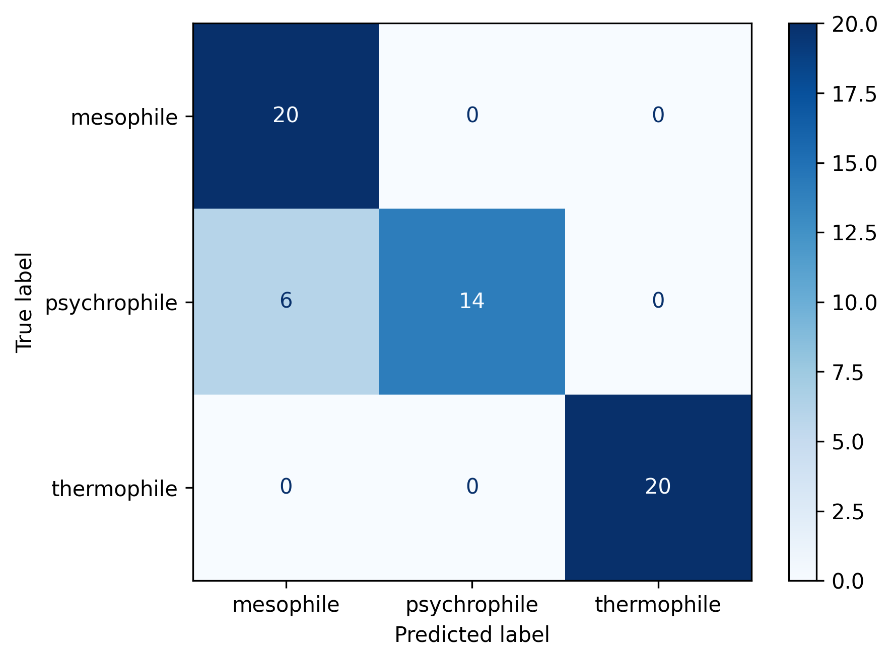
**Figure 18.** Confusion matrix showing classification performance of the Summary TMP implementation on the benchmark dataset.

\newpage

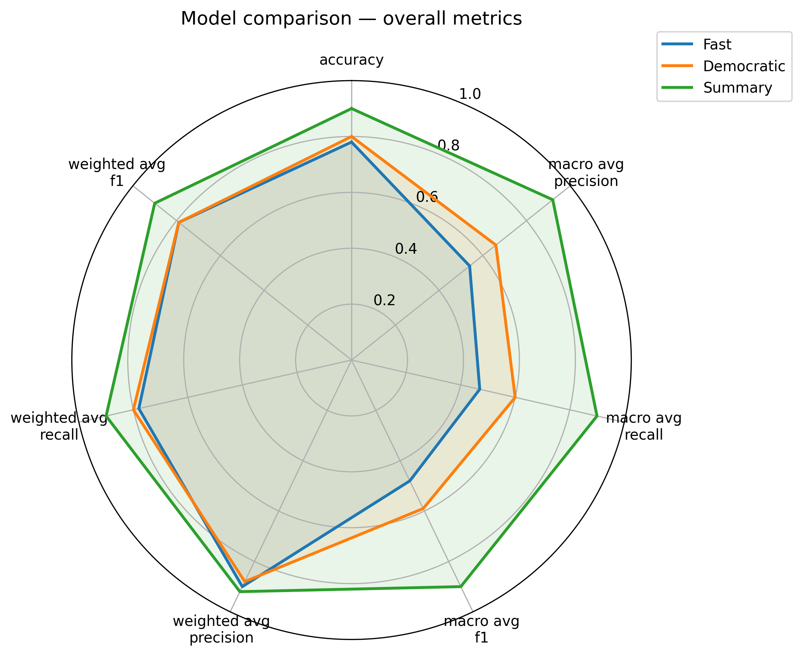
**Figure 19.** Comparison of TMP workflow performance using classification metrics. Radar plot showing accuracy, macro-averaged precision, recall and F1-score for the Fast, Democratic and Summary implementations evaluated on the 60-protein benchmark dataset. Each axis represents a classification metric, with values normalised between 0 and 1. Higher values indicate improved performance across the benchmark dataset.


| TMP Implementation | Accuracy | Macro Precision | Macro Recall | Macro F1-score | Runtime (min) |
|--------------------|----------|-----------------|--------------|----------------|---------------|
| Fast               | 0.78     | 0.54            | 0.47         | 0.48           | 73.59         |
| Democratic         | 0.80     | 0.66            | 0.60         | 0.59           | 158.11        |
| Summary            | 0.90     | 0.92            | 0.90         | 0.90           | 210.05        |
**Table 3.** Comparison of TMP implementation performance on the 60-protein benchmark dataset. Classification metrics represent overall model performance across psychrophilic, mesophilic and thermophilic classes, while runtime indicates the computational time required to complete all classifications.


### 3.2.4 Agreement between TMP and Seq2Topt

To investigate the relationship between sequence-based thermal predictions and literature-derived thermal classifications, Seq2Topt-predicted optimal temperatures were compared with TMP classifications for the high-confidence UvsX candidate dataset.


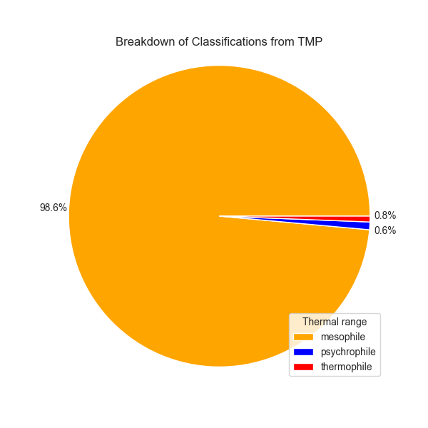
**Figure 20.** Distribution of TMP-derived thermal classifications across the 1,498 high-confidence UvsX candidate proteins.

TMP classified the majority of candidate proteins as mesophilic, accounting for 98.6% of all predictions. Thermophilic and psychrophilic classifications represented a small proportion of the dataset, accounting for 0.8% and 0.6% of candidates, respectively.

To compare TMP classifications with sequence-based thermal predictions, Seq2Topt-predicted optimal temperatures were plotted according to TMP thermal categories (Figure 21). Candidates classified as psychrophilic by TMP exhibited lower predicted optimal temperatures compared with candidates classified as thermophilic, indicating that the two approaches identified consistent trends in thermal adaptation.


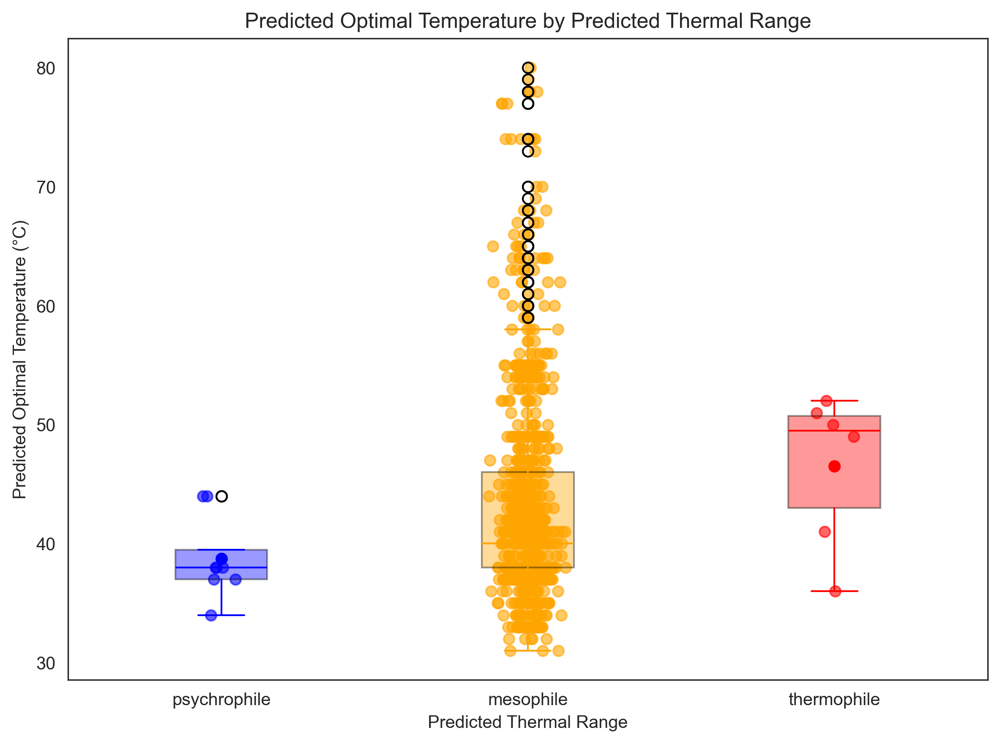
**Figure 21.** Distribution of Seq2Topt-predicted optimal temperatures grouped by TMP thermal classification.

Despite the strong enrichment of candidates within the mesophilic category, the distribution of Seq2Topt predictions showed overlap between thermal classes. This indicates that while TMP classifications and sequence-based predictions captured broad differences in thermal adaptation, predicted optimal temperatures alone were insufficient to clearly separate all thermal groups.


## 3.3 Structural prediction and validation of UvsX proteins
### 3.3.1 Comparison of structure prediction methods

Structural models generated using AlphaFold and Boltz were compared against experimentally determined crystal structures of the gold standard UvsX proteins using US-align. Structural similarity was assessed using TM-score normalised by the reference crystal structure together with root mean square deviation (RMSD).

| Protein | Prediction method | TM-score | RMSD (Å) |
|---------|-------------------|---------:|---------:|
| T4 UvsX | AlphaFold | 0.682 | 1.03 |
| T4 UvsX (PDB trimmed) | AlphaFold | 0.809 | 1.02 |
| T4 UvsX (SWISS trimmed) | AlphaFold | 0.849 | 1.09 |
| 7Z3M | AlphaFold | 0.770 | 1.89 |
| 9GBG | AlphaFold | 0.821 | 1.51 |
| T4 UvsX | Boltz | 0.251 | 6.63 |
| T4 UvsX (PDB trimmed) | Boltz | 0.255 | 5.94 |
| T4 UvsX (SWISS trimmed) | Boltz | 0.279 | 6.68 |
| 7Z3M | Boltz | 0.268 | 6.50 |
| 9GBG | Boltz | 0.262 | 5.86 |

**Table 4.** Structural similarity between predicted models and experimentally determined crystal structures measured using US-align. TM-scores are normalised by the length of the reference crystal structure.

AlphaFold consistently generated structural models with high similarity to the experimentally determined crystal structures. TM-scores ranged from 0.682 to 0.849, while RMSD values ranged from 1.02 Å to 1.89 Å, indicating close agreement between predicted and experimental structures.

For T4 UvsX, prediction accuracy improved when the AlphaFold model was generated using a sequence corresponding to the experimentally resolved region of the protein. The PDB structure contains residues 30–358, while the SWISS-MODEL trimmed sequence covered residues 31–342, reducing the influence of unresolved terminal regions. This approach produced the highest structural agreement, achieving a TM-score of 0.849 and an RMSD of 1.09 Å. Similar agreement was observed for the thermophilic (7Z3M) and psychrophilic (9GBG) reference proteins, which achieved TM-scores of 0.770 and 0.821, respectively.

In contrast, Boltz predictions exhibited substantially lower agreement with the crystal structures. TM-scores ranged from 0.251 to 0.279, with RMSD values between 5.86 Å and 6.68 Å, indicating considerably poorer structural accuracy across all reference proteins.

These results demonstrate that AlphaFold consistently produced more accurate structural models of UvsX proteins than Boltz and was therefore selected as the primary structure prediction method for downstream analyses.

\newpage

\begin{figure}[H]
\centering
\includegraphics[width=\textwidth]{images/uvsx_boltz_alignment.png}\\[-5pt]
\includegraphics[width=\textwidth]{images/uvsx_alphafold_alignment.png}
\end{figure}

**Figure 22.** Comparison of AlphaFold and Boltz predicted T4 UvsX structures with the experimentally determined crystal structure. AlphaFold, Boltz and experimental structures are shown in pink, blue and green, respectively. The predicted models were aligned to the reference crystal structure using US-align, and structural agreement was assessed using TM-score and RMSD.


### 3.3.2 Effect of sequence input strategy on Boltz prediction

Several alternative sequence preparation strategies were evaluated to determine whether Boltz prediction accuracy could be improved. These included prediction from full-length protein sequences, trimmed sequences corresponding to experimentally resolved structural regions, UniRef100 multiple sequence alignments generated using ColabFold, and custom multiple sequence alignments generated from the curated UvsX candidate database.

| Input strategy | T4 UvsX | 7Z3M | 9GBG |
|----------------|---------:|-----:|-----:|
| Full-length sequence | 0.251 | 0.268 | 0.262 |
| Trimmed sequence | 0.279 | — | — |
| UniRef100 MSA | 0.293 | 0.269 | 0.266 |
| Custom UvsX MSA | 0.243 | 0.229 | 0.259 |

**Table 5.** Comparison of Boltz prediction strategies using TM-scores normalised by the reference crystal structure.

For T4 UvsX, both sequence trimming and incorporation of a UniRef100 multiple sequence alignment produced modest improvements in structural similarity compared with prediction from the full-length sequence. The highest TM-score obtained using Boltz was 0.293 when a UniRef100 multiple sequence alignment generated using ColabFold was supplied.

Supplying a custom multiple sequence alignment generated from the curated UvsX candidate database did not improve prediction accuracy and generally produced lower TM-scores than the UniRef100 alignment.

For the thermophilic (7Z3M) and psychrophilic (9GBG) reference proteins, only minimal differences were observed between the alternative prediction strategies, with all TM-scores remaining below 0.30. Overall, modifications to sequence preparation and multiple sequence alignment inputs were insufficient to substantially improve Boltz prediction accuracy for UvsX proteins.


## 3.4 Molecular dynamics analysis of UvsX thermal adaptation

Molecular dynamics simulations were performed to investigate whether AlphaFold-generated models captured comparable patterns of structural stability, flexibility and global conformational behaviour to experimentally characterised proteins. Following this assessment, AlphaFold structures were used for molecular dynamics simulations of representative UvsX orthologs identified through the TMP classification pipeline.


### 3.4.1 Validation of AlphaFold structures using experimentally characterised UvsX proteins

To evaluate whether AlphaFold-generated structures were suitable for molecular dynamics analysis, experimentally characterised UvsX proteins were used as validation cases. Molecular dynamics simulations were performed using both experimentally determined crystal structures and corresponding AlphaFold predictions for three reference proteins representing different thermal adaptations: psychrophilic 9GBG, mesophilic T4 UvsX and thermophilic 7Z3M.

Structural behaviour was assessed using RMSD, RMSF and radius of gyration (Rg) analyses to compare the stability, residue-level flexibility and global compactness of predicted and experimentally determined structures.


#### 3.4.1.1 Structural stability comparison using RMSD

Root mean square deviation (RMSD) was calculated to compare structural deviation between AlphaFold-predicted and experimentally determined UvsX structures during molecular dynamics simulations.


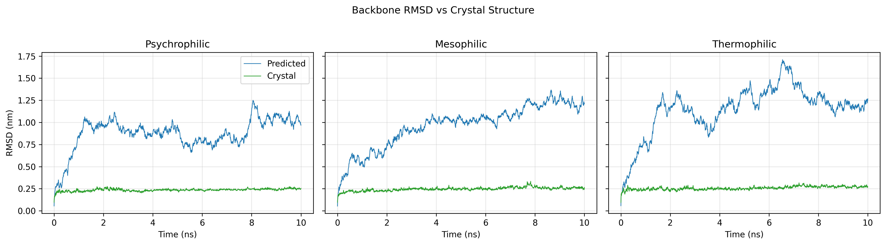
**Figure 23.** RMSD profiles comparing experimentally determined and AlphaFold-predicted T4 UvsX structures during molecular dynamics simulations.

The experimentally determined T4 UvsX structure displayed low RMSD values across all simulated temperature conditions. Mean RMSD values ranged from 0.236–0.257 nm, with similar values observed under psychrophilic, mesophilic and thermophilic conditions. The corresponding AlphaFold-predicted structure showed increased structural deviation compared with the experimental structure. Mean RMSD values ranged from 0.872–1.147 nm with the highest deviation observed under thermophilic conditions (Figure 23).


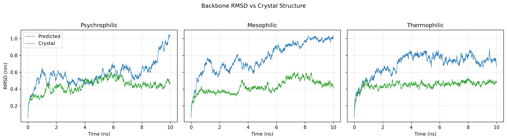
**Figure 24.** RMSD profiles comparing experimentally determined and AlphaFold-predicted 7Z3M UvsX structures during molecular dynamics simulations.

The 7Z3M thermophilic UvsX protein showed closer agreement between predicted and experimental simulations compared with T4 UvsX. The crystal structure displayed mean RMSD values between 0.427–0.450 nm, while the AlphaFold model showed mean RMSD values ranging from 0.583–0.779 nm (Figure 24).


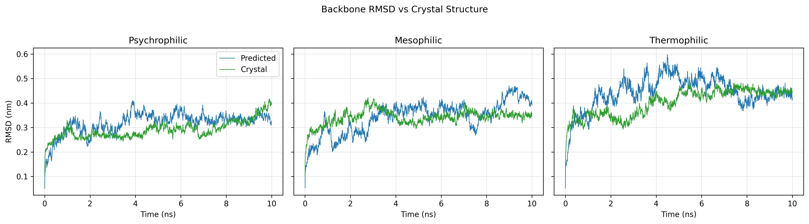
**Figure 25.** RMSD profiles comparing experimentally determined and AlphaFold-predicted 9GBG UvsX structures during molecular dynamics simulations.

The psychrophilic 9GBG protein displayed the lowest difference between predicted and experimental RMSD profiles. The crystal structure showed mean RMSD values between 0.291–0.402nm, while the AlphaFold model exhibited mean RMSD values ranging from 0.318–0.442 nm (Figure 25).


#### 3.4.1.2 Comparison of residue flexibility between predicted and experimental structures

Residue-level flexibility was assessed using root mean square fluctuation (RMSF) analysis to compare local mobility patterns between AlphaFold-generated and experimentally determined structures.


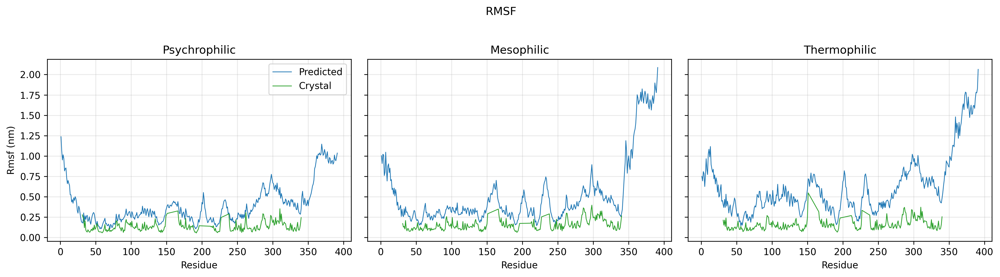


**Figure 26.** RMSF profiles comparing experimentally determined and AlphaFold-predicted T4 UvsX structures during molecular dynamics simulations.

The experimentally determined T4 UvsX structure showed low residue fluctuations across all conditions, with mean RMSF values ranging from 0.133–0.158 nm.
The AlphaFold-predicted structure exhibited increased residue mobility, with mean RMSF values ranging from 0.401–0.624 nm (Figure 26). 


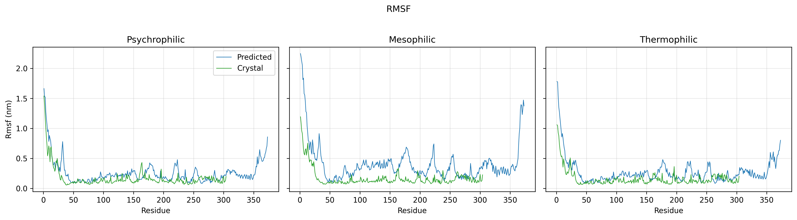
**Figure 27.** RMSF profiles comparing experimentally determined and AlphaFold-predicted 7Z3M UvsX structures during molecular dynamics simulations.

The 7Z3M crystal structure displayed mean RMSF values between 0.162–0.175 nm, while the AlphaFold model showed increased values ranging from 0.263–0.410 nm (Figure 27).


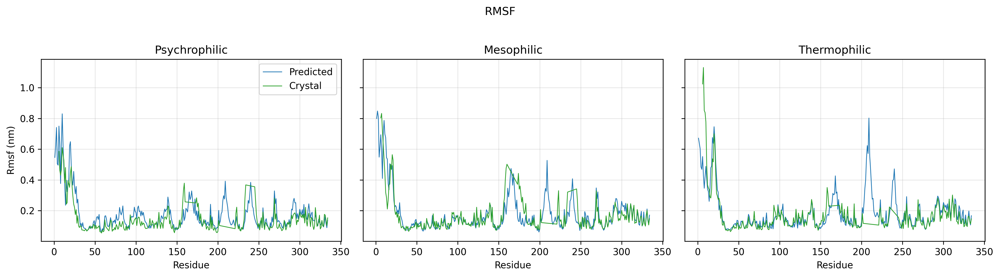
**Figure 28.** RMSF profiles comparing experimentally determined and AlphaFold-predicted 9GBG UvsX structures during molecular dynamics simulations.

The psychrophilic 9GBG protein displayed the closest agreement in residue flexibility between predicted and experimental structures. The crystal structure exhibited mean RMSF values between 0.133–0.154 nm, while the AlphaFold model showed values ranging from 0.263–0.526 nm (Figure 28).

Across all three reference proteins, AlphaFold predictions showed increased RMSF values compared with experimental structures, while maintaining similar overall flexibility profiles.


#### 3.4.1.3 Comparison of global structural compactness

Radius of gyration (Rg) was analysed to compare global structural compactness between AlphaFold-generated and experimentally determined UvsX structures.


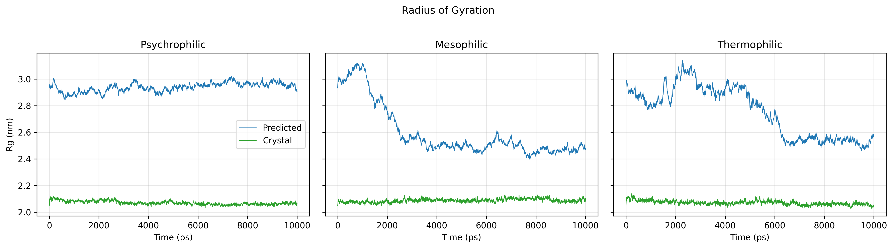
**Figure 29.** Radius of gyration profiles comparing experimentally determined and AlphaFold-predicted T4 UvsX structures during molecular dynamics simulations.

The T4 UvsX crystal structure maintained stable compactness throughout the simulations, with mean Rg values ranging from 2.070–2.087 nm and low variation between trajectories. The AlphaFold-predicted T4 UvsX structure displayed increased Rg values, ranging from 2.599–2.939 nm, with greater variation observed under mesophilic (310k) and thermophilic conditions (338k) (Figure 29).


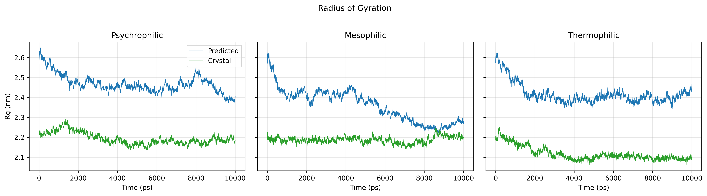
**Figure 30.** Radius of gyration profiles comparing experimentally determined and AlphaFold-predicted 7Z3M UvsX structures during molecular dynamics simulations.

The 7Z3M crystal structure displayed mean Rg values between 2.117–2.193 nm, while the AlphaFold model showed slightly higher mean values ranging from 2.360–2.469 nm (Figure 30).


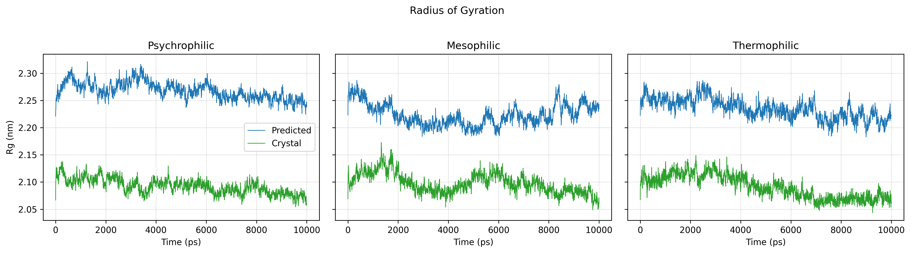
**Figure 31.** Radius of gyration profiles comparing experimentally determined and AlphaFold-predicted 9GBG UvsX structures during molecular dynamics simulations.

The 9GBG AlphaFold model maintained a similar overall Rg profile, means ranging from 2.223-2.268nm to the experimentally determined structure with means ranging from 2.091-2.098nm, although the predicted model consistently displayed higher absolute Rg values. (Figure 31)


### 3.4.2 Molecular dynamics behaviour of thermally adapted UvsX orthologs
Following validation of AlphaFold predictions against experimentally determined structures, representative UvsX orthologs from different thermal environments were simulated using predicted structures.


#### 3.4.2.1 Structural stability differs between thermal groups

To investigate whether UvsX proteins assigned to different thermal adaptation groups displayed distinct structural stability profiles, RMSD analysis was performed on representative psychrophilic, mesophilic and thermophilic candidates identified through the TMP pipeline. Three proteins from each thermal group were selected and simulated under three temperature conditions representing psychrophilic (288K), mesophilic (310K) and thermophilic (338K) environments.

Root mean square deviation (RMSD) was used to assess structural deviation from the initial protein conformation throughout the simulations, with lower RMSD values indicating greater structural stability.


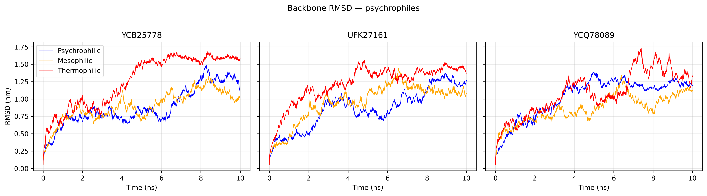
**Figure 32.** RMSD profiles of three TMP-classified psychrophilic UvsX orthologs simulated under psychrophilic (288K), mesophilic (310K) and thermophilic (338K) conditions.


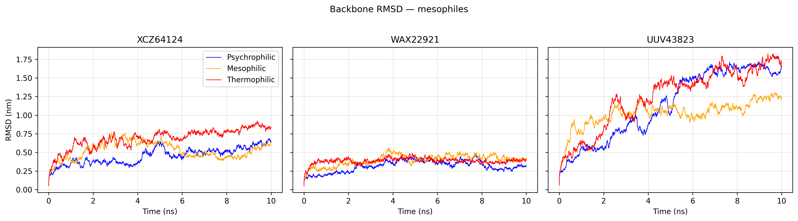
**Figure 33.** RMSD profiles of three TMP-classified mesophilic UvsX orthologs simulated under psychrophilic (288K), mesophilic (310K) and thermophilic (338K) conditions.


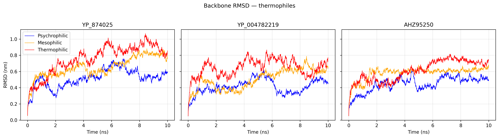
**Figure 34.** RMSD profiles of three TMP-classified thermophilic UvsX orthologs simulated under psychrophilic (288K), mesophilic (310K) and thermophilic (338K) conditions.

RMSD analysis revealed differences in structural stability between the three TMP-classified thermal groups. Thermophilic orthologs generally exhibited the lowest structural deviation, psychrophilic orthologs displayed the greatest conformational flexibility, and mesophilic proteins showed intermediate behaviour. However, these differences were maintained across simulation temperatures, suggesting that the observed differences may reflect inherent structural characteristics associated with thermal classification rather than simple optimisation of stability at a single temperature.

Psychrophilic candidates generally exhibited the highest RMSD values across all simulation conditions, with mean values ranging from approximately 0.86–1.26nm. For example, YCB25778 increased from 0.89 nm at 288K to 1.26nm at 338K, while UFK27161 similarly showed increased structural deviation under elevated temperature, reaching a mean RMSD of 1.22nm at 338K. These observations indicate that psychrophilic orthologs generally underwent larger conformational rearrangements during simulation, particularly at higher temperatures.

In contrast, thermophilic candidates consistently maintained lower RMSD values, ranging from 0.41–0.76nm across all conditions. YP_004782219 displayed the greatest overall stability, with mean RMSD values of 0.41nm, 0.50nm and 0.65nm at 288K, 310K and 338K, respectively. Although several thermophilic proteins showed increasing RMSD with temperature, for example, YP_874025 increased from 0.52 nm to 0.76 nm between 288K and 338K, they nevertheless remained more structurally stable than the psychrophilic candidates.

Mesophilic orthologs generally displayed intermediate RMSD values, although substantial variation was observed between individual proteins, with values ranging from approximately 0.32–1.24 nm across the simulation conditions. Temperature-dependent increases in structural deviation were also observed within this group, although the magnitude of these changes varied between individual proteins.

Collectively, RMSD analysis showed that thermophilic orthologs generally exhibited lower structural deviation than psychrophilic candidates, while mesophilic proteins displayed intermediate behaviour. These differences were observed across all simulation temperatures, with many proteins exhibiting increased RMSD at elevated temperature, although temperature-dependent responses varied between individual orthologs.

#### 3.4.2.2 Residue flexibility differs between thermal groups

To investigate whether thermal adaptation was associated with differences in local protein flexibility, residue-level fluctuations were analysed using root mean square fluctuation (RMSF). RMSF values represent the average displacement of individual residues throughout the simulation and provide insight into regions of increased flexibility within each UvsX ortholog.


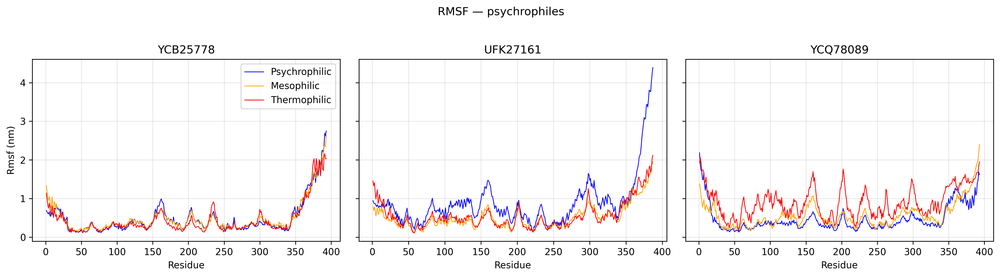
**Figure 35.** RMSF profiles of three TMP-classified psychrophilic UvsX orthologs simulated under psychrophilic (288K), mesophilic (310K), and thermophilic (338K) conditions.


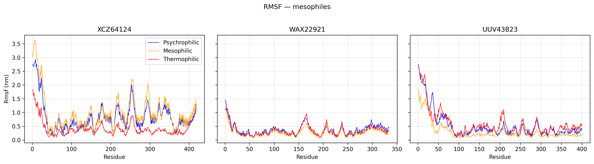
**Figure 36.** RMSF profiles of three TMP-classified mesophilic UvsX orthologs simulated under psychrophilic (288K), mesophilic (310K), and thermophilic (338K) conditions.


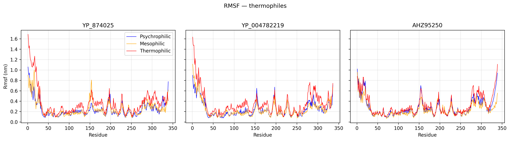
**Figure 37.** RMSF profiles of three TMP-classified thermophilic UvsX orthologs simulated under psychrophilic (288K), mesophilic (310K), and thermophilic (338K) conditions.

RMSF analysis revealed distinct patterns of residue-level flexibility between the three TMP-classified thermal groups. Thermophilic orthologs generally displayed reduced residue fluctuations, consistent with increased structural rigidity, whereas psychrophilic candidates exhibited greater flexibility. Mesophilic proteins showed intermediate behaviour but displayed substantial variation between individual sequences.

Psychrophilic candidates showed the greatest overall residue mobility, with mean RMSF values ranging from 0.447–0.879 nm across the simulated conditions. UFK27161 exhibited the highest flexibility among the analysed proteins, with a mean RMSF of 0.879 nm under psychrophilic (288k) conditions. In contrast, YCB25778 displayed a more moderate flexibility profile, with mean RMSF values ranging from 0.447–0.493 nm across all temperatures, demonstrating that psychrophilic proteins do not share a uniform dynamic behaviour.

Thermophilic orthologs displayed the lowest and most consistent RMSF values across the dataset, with mean fluctuations ranging from 0.240–0.362 nm. YP_004782219 showed particularly limited residue mobility, with mean RMSF values of 0.243 nm, 0.240 nm and 0.352 nm under psychrophilic, mesophilic (310k) and thermophilic (338k) simulation conditions, respectively. Although residue flexibility increased slightly at elevated temperature, the magnitude of this change remained substantially lower than observed for several psychrophilic and mesophilic candidates, indicating that thermophilic proteins maintained a more constrained dynamic state.

Mesophilic proteins exhibited intermediate flexibility but showed the greatest variation between individual orthologs. WAX22921 maintained relatively low RMSF values across all conditions (0.270–0.368 nm), whereas XCZ64124 displayed substantially increased flexibility, particularly under mesophilic conditions (310k) where mean RMSF reached 1.003 nm. This variability suggests that mesophilic proteins represent a broader dynamic category rather than a single conserved flexibility profile.

Overall, RMSF analysis supports the presence of distinct dynamic characteristics associated with thermal adaptation. Thermophilic UvsX proteins generally maintained reduced residue mobility, whereas psychrophilic candidates displayed increased flexibility, consistent with greater local conformational mobility. However, the variability observed within each thermal group indicates that flexibility is influenced by protein-specific sequence and structural features rather than temperature alone.


#### 3.4.2.3 Changes in global structural compactness between thermal groups 

Radius of gyration (Rg) was analysed to investigate differences in global protein compactness between TMP-classified UvsX orthologs. Rg provides a measure of the overall dimensions of a protein structure, with lower values indicating a more compact conformation.


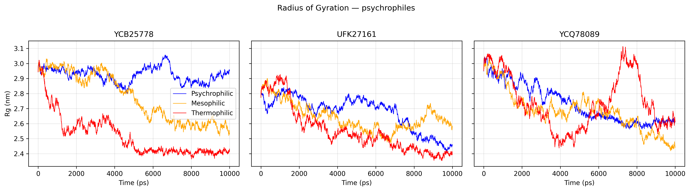
**Figure 38.** Radius of gyration profiles of three TMP-classified psychrophilic UvsX orthologs simulated under psychrophilic (288K), mesophilic (310K), and thermophilic (338K) conditions.


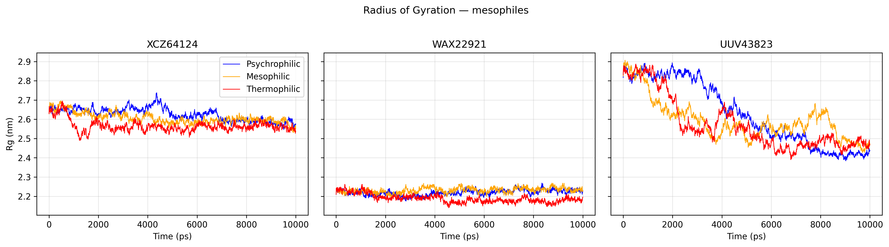
**Figure 39.** Radius of gyration profiles of three TMP-classified mesophilic UvsX orthologs simulated under psychrophilic (288K), mesophilic (310K), and thermophilic (338K) conditions.


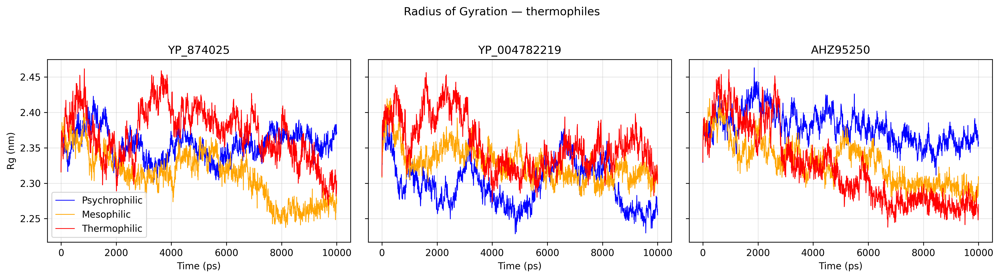
**Figure 40.** Radius of gyration profiles of three TMP-classified thermophilic UvsX orthologs simulated under psychrophilic (288K), mesophilic (310K), and thermophilic (338K) conditions.

Rg analysis revealed differences in global structural organisation between thermal groups, with thermophilic UvsX orthologs maintaining the most consistent compactness across simulation conditions. In contrast, psychrophilic candidates displayed greater variation in global dimensions, indicating increased structural rearrangement during temperature changes. Mesophilic proteins showed intermediate behaviour, with substantial variability between individual orthologs.

Thermophilic candidates maintained the most stable global architecture, with mean Rg values remaining within a narrow range of approximately 2.30–2.38 nm across all three proteins and simulation conditions. This limited variation indicates that thermophilic UvsX proteins preserved their overall structural organisation despite changes in temperature. Although relatively small temperature-dependent changes in Rg were observed, these changes were generally limited in magnitude, with some proteins showing increases and others decreases at elevated temperatures.

Psychrophilic candidates exhibited greater variation in global compactness, with mean Rg values ranging from 2.52–2.93 nm. YCB25778 displayed the largest temperature-dependent change, decreasing from a mean Rg of 2.925 nm under psychrophilic (288k) conditions to 2.516 nm under thermophilic conditions (338k). UFK27161 showed a smaller but consistent decrease in Rg with increasing temperature, whereas YCQ78089 exhibited comparatively little net change, with Rg decreasing slightly at 310 K before returning to a similar value at 338 K. These results indicate that some psychrophilic proteins underwent substantial changes in global structural organisation in response to temperature variation, although the magnitude and direction of these changes varied between individual proteins.

Mesophilic orthologs displayed intermediate behaviour but showed considerable variability between individual proteins. WAX22921 maintained relatively compact structures across all conditions, with Rg values of approximately 2.2 nm, whereas XCZ64124 and UUV43823 exhibited larger temperature-dependent changes in global compactness. This suggests that mesophilic proteins represent a diverse group with variable structural responses despite similar predicted thermal classifications.


## 3.5 Integrated identification of promising psychrophilic UvsX candidates

Following sequence-based identification and molecular dynamics analysis, candidates were prioritised by integrating TMP thermal classification with their simulated structural dynamics. Selection focused on increased conformational flexibility while maintaining overall structural organisation.

| Candidate               | Key MD evidence                                                                                            |
|-------------------------|------------------------------------------------------------------------------------------------------------|
| UFK27161                | Highest residue-level flexibility, with highest mean RMSF, alongside moderate structural compactness.      |
| YCB25778                | Increased flexibility and temperature-dependent structural variation with a relatively stable RMSF profile. |
| YCQ78089                | Moderate-to-high flexibility while maintaining relatively stable global compactness.                       |

**Table 6.** Summary of key molecular dynamics characteristics of selected psychrophilic UvsX candidates identified through TMP classification. Candidates are compared based on residue-level flexibility and global structural compactness.

These candidates represent the most promising targets for future experimental characterisation. UFK27161 due to its pronounced flexibility, while YCB25778 and YCQ78089 displayed more moderate dynamic profiles. Experimental testing will be required to determine whether these structural characteristics translate into enhanced recombinase activity at low temperatures.

\newpage

# 4 Discussion

## 4.1 Evaluation of the computational discovery pipeline for identifying cold-adapted UvsX orthologs
The central aim of this project was to develop a computational pipeline capable of identifying potential cold-adapted UvsX orthologs from public databases. The pipeline reduced over 26,000 initial protein sequences to three priority psychrophilic candidates, demonstrating its ability to narrow a large candidate pool to a small number of proteins with the strongest evidence for potential cold adaptation, suitable for future experimental validation. This highlights the value of the pipeline as a tool for directing experimental efforts towards the most promising UvsX orthologs.

The combination of sequence curation, HMM-based identification, conserved motif screening, thermal classification and molecular dynamics analysis enabled candidates to be prioritised using multiple independent features rather than sequence similarity alone. This increased confidence that the selected proteins represented genuine UvsX orthologs with characteristics consistent with cold adaptation.

Although computational analysis cannot confirm improved RPA activity at ambient temperatures, the identification of three promising candidates provides focused targets for experimental validation. Following recombinant expression and purification, ATPase activity, ssDNA binding, presynaptic filament formation and DNA strand exchange assays performed across a range of temperatures could determine whether these candidates retain recombinase activity and exhibit characteristics consistent with psychrophilic adaptation.

## 4.2 Balancing sensitivity and specificity in UvsX candidate screening
The in-silico screening strategy required balancing sensitivity and specificity when identifying candidate UvsX orthologs. The use of multiple HMM profiles provided a stringent approach for identifying proteins with similarity to characterised UvsX sequences. Importantly, the substantial overlap between HMM searches indicated strong concordance between the different profiles, with the models largely identifying the same candidate proteins. No individual HMM identified a substantial set of candidates that was not recovered by the other models, suggesting that candidate identification was not strongly dependent on the choice of HMM profile. This agreement provides increased confidence that the retained candidates represent proteins with sequence characteristics consistent with UvsX orthologs, while also reducing the likelihood that candidate selection was driven by the properties of a single model.

Similarly, requiring conserved ATP-binding motifs provided increased confidence that retained candidates possessed canonical ATP-hydrolysis machinery, but at the cost of potentially excluding functionally divergent variants. For example, the experimentally characterised psychrophilic ortholog 9GBG lacks a canonical Walker B motif and shows reduced ATPase activity relative to canonical orthologs (Tarrant, 2026), consistent with the rationale for requiring this motif during screening. However, 9GBG also exhibits higher strand-exchange activity than canonical orthologs (Tarrant, 2026), indicating that ATPase efficiency and strand-exchange efficiency can be uncoupled in divergent UvsX orthologs. This suggests that strict Walker B filtering, while appropriate for excluding candidates with impaired ATP hydrolysis, may also exclude orthologs whose strand-exchange activity, arguably the more functionally relevant readout for RPA, remains high despite atypical ATPase kinetics.

In this study, stringent filtering criteria were deliberately applied to prioritise candidates with high confidence for functional UvsX activity, favouring specificity over sensitivity. This approach reduced the likelihood of progressing false-positive candidates into downstream thermal prediction and structural analyses but may also have excluded more divergent UvsX orthologs that retain recombinase activity despite lacking canonical sequence characteristics. Future iterations of the pipeline could therefore explore less restrictive filtering strategies, such as allowing greater variation within ATP-binding motifs, incorporating adaptive motif thresholds, or including candidates identified by fewer HMM criteria. Such approaches may increase the discovery of divergent cold-adapted recombinases while maintaining confidence through subsequent structural and functional analyses.

## 4.3 Limitations of ab-initio thermal prediction
Seq2Topt's misclassifications likely reflect the composition of the training dataset, which contained only 461 psychrophilic proteins out of 2917 total samples. Therefore, the model had comparatively limited representation of proteins adapted to low temperatures, potentially reducing its ability to accurately predict candidates within this range. Additionally, thermal adaptation may be encoded through subtle sequence changes associated with flexibility and stability rather than broad amino acid composition patterns, which may not be fully captured by the features used by Seq2Topt.

This limitation was demonstrated by the misclassification of 9GBG, a psychrophilic candidate, which was predicted to have a higher optimal temperature than 7Z3M, a known thermophilic protein. Seq2Topt uses protein language model embeddings generated from the amino acid sequence, allowing it to capture complex sequence patterns beyond simple amino acid composition. However, predictions remain dependent on the extent to which sequence-derived features reflect thermal adaptation.

Psychrophilic adaptation is often associated with subtle structural and biophysical changes that promote increased flexibility and activity at low temperatures. These adaptations may arise from specific residue substitutions, altered local interactions, or changes in protein stability rather than strong global sequence patterns. Consequently, sequence embeddings may not always capture the features that distinguish cold-adapted proteins from proteins adapted to higher temperatures, particularly when these differences are subtle or context-dependent.

The misclassifications highlight a limitation of relying solely on sequence-based prediction, where biologically meaningful thermal adaptations may not always translate into clear sequence-level signals. This limitation motivated the development of TMP, which incorporates literature-derived evidence as an additional source of information for classifying candidate cold-adapted recombinases within this study.

## 4.4 Performance and limitations of agentic literature-based thermal classification
This performance difference between thermal groups likely reflects the unequal availability and depth of information describing proteins from different thermal environments. Thermophilic organisms and proteins have been extensively studied, with many well-characterised examples and clearer descriptions of the molecular features associated with thermal adaptation. This provides a stronger knowledge base for identifying thermophilic characteristics through literature-derived evidence.

In contrast, mesophilic proteins represent the most commonly studied group and are often used as the default comparison when describing protein function and environmental adaptation. Distinguishing between mesophilic and psychrophilic proteins can therefore be more challenging, particularly when specific cold-adaptation features are not explicitly reported. This imbalance was also evident in the NCBI literature search, where only 12.9% of papers returned using the terms “mesophile”, “thermophile” and “psychrophile” were associated with the psychrophile search. Consequently, psychrophilic examples were comparatively limited and often originated from a small number of species. This restricted the diversity of available evidence for literature-based classification and may reduce confidence when distinguishing genuine psychrophilic adaptations from broader descriptions of protein function or environmental context. As additional psychrophilic phages and their proteins are experimentally characterised, the availability and diversity of supporting evidence should improve, potentially increasing the reliability of TMP classifications.

By incorporating a relevance check and summarising information across multiple literature sources, SummaryTMP reduced the likelihood of erroneous classifications caused by reliance on a single retrieved example, as observed in the fast version. This allowed classifications to be based on a broader representation of the available evidence rather than the first relevant result identified. Additionally, the summary approach helped address potential biases introduced by the democratic version, where classifications could be disproportionately influenced by the weighting or selection of individual literature examples. By integrating evidence across sources, the summary approach provided a more consistent interpretation of thermal adaptation characteristics and improved confidence in the resulting classifications.

Future improvements could include expanding TMP beyond its current implementation by incorporating access to cloud-based large language models through application programming interfaces (APIs), allowing more efficient retrieval and interpretation of relevant literature. Additionally, development of a graphical user interface or web-based application would improve accessibility and enable broader application of TMP for screening candidate proteins.

## 4.5 Complementary evidence from Seq2Topt and TMP for UvsX thermal classification
The agreement between Seq2Topt and TMP provides additional confidence in the candidate classifications, as the two approaches rely on different sources of information. The observed separation in predicted optimal temperatures (Figure 21) suggests that sequence-level signals captured by Seq2Topt were broadly consistent with the literature-based TMP classifications, supporting the value of combining both approaches to identify potential cold-adapted recombinases.

## 4.6 Evaluation of Boltz and AlphaFold for UvsX structural prediction
AlphaFold consistently outperformed boltz despite attempts to improve Boltz's performance; sequence trimming, UniRef100 alignments, custom UvsX MSAs, produced only marginal gains all well short of AlphaFold's accuracy (Results 3.3.2).This gap likely reflects differences in how each model processes sequence and evolutionary information. AlphaFold has been extensively benchmarked and benefits from large-scale training on experimentally determined structures and optimised prediction pipelines. In contrast, Boltz may require further optimisation of input preparation, model parameters, or inference settings for accurate prediction of divergent protein families such as UvsX. Additional approaches, such as testing alternative MSA generation methods, increasing prediction sampling, or optimising model-specific parameters, may improve future Boltz performance.

Despite the reduced accuracy of Boltz predictions in this study, the evaluation demonstrates the importance of validating structural prediction methods against experimentally determined references before applying them to novel candidates. Based on the strong agreement between AlphaFold predictions and available crystal structures, AlphaFold was selected as the preferred method for downstream structural analysis of candidate UvsX proteins.


## 4.7 Validation of AlphaFold-generated UvsX structures for molecular dynamics analysis

Across RMSD, RMSF and radius of gyration analyses, AlphaFold models reproduced the major dynamic characteristics observed for experimentally determined UvsX structures. However, predicted structures generally displayed greater conformational variation than their corresponding crystal structures, including increased structural deviation, residue-level flexibility and changes in global compactness. This suggests that AlphaFold models successfully capture the overall structural architecture of UvsX proteins while sampling a broader range of conformational states during molecular dynamics simulations.

The strongest agreement between predicted and experimental structures was observed for the psychrophilic 9GBG and thermophilic 7Z3M proteins. Both models exhibited similar patterns of structural stability, flexibility and compactness across simulation conditions, despite differences in the magnitude of fluctuations. These results indicate that AlphaFold-generated structures can reproduce the major dynamic characteristics of experimentally characterised UvsX proteins and are suitable for comparative analyses of thermal adaptation.

The largest differences between predicted and experimental simulations were observed for T4 UvsX. Although the AlphaFold model showed high structural similarity to the experimentally resolved structure, it displayed increased RMSD, RMSF and radius of gyration values during molecular dynamics simulations. Since both structures represented the monomeric form of T4 UvsX, these differences are unlikely to result from differences in oligomeric state. Instead, they likely reflect differences between a crystallographically stabilised structure and a predicted model capable of exploring a broader conformational landscape. Crystal structures represent a single experimentally resolved state that may be influenced by crystal packing interactions and experimental conditions, whereas AlphaFold models may contain regions of increased conformational freedom that become apparent during simulation.

Increasing temperature generally increased conformational flexibility in AlphaFold-predicted UvsX structures, particularly for T4 UvsX, where higher simulation temperatures resulted in increased RMSD and RMSF values. However, this relationship was not consistent across all proteins, with 7Z3M displaying the greatest flexibility under mesophilic rather than thermophilic conditions. This suggests that thermal adaptation is not determined solely by a universal increase in rigidity at elevated temperatures, but instead reflects protein-specific structural features that influence conformational stability and temperature-dependent behaviour. The greater stability observed in experimentally determined structures across conditions further supports the interpretation that AlphaFold models sample a wider conformational landscape during molecular dynamics simulations.

The increased flexibility observed in AlphaFold models compared with crystal structures does not necessarily indicate reduced prediction accuracy. Instead, it may reflect the ability of molecular dynamics simulations to explore conformational states that are not represented within static experimental structures. Therefore, the purpose of AlphaFold validation in this study was not to reproduce experimental trajectories exactly, but to establish whether predicted structures retained sufficient accuracy for comparative analysis of UvsX dynamics. The preservation of overall trends between predicted and experimental models demonstrates that AlphaFold structures provide reliable starting points for investigating sequence-dependent differences in stability, flexibility and compactness among candidate orthologs.

Together, these findings support the use of AlphaFold-generated structures for downstream molecular dynamics analysis of UvsX proteins. Although predicted structures may exhibit greater conformational mobility than experimentally determined models, they provide suitable representations for assessing structural characteristics associated with thermal adaptation.

## 4.8 Molecular dynamics reveals differences in thermal adaptation among UvsX orthologs
Molecular dynamics simulations provided an additional layer of structural evidence for the TMP classifications by assessing whether predicted thermal groups exhibited distinct conformational behaviours. Based on established differences in protein thermal adaptation, thermophilic proteins were expected to exhibit greater structural stability, whereas psychrophilic proteins may display increased conformational flexibility (Åqvist, 2017).

Consistent with the RMSD, RMSF and Rg results (Results 3.4.2), thermophilic orthologs, including 7Z3M, generally exhibited the most stable dynamic profiles. However, this pattern was not consistent across all psychrophilic candidates. Several TMP-classified psychrophilic candidates displayed increased conformational flexibility compared with thermophilic proteins. However, comparison with the experimentally characterised psychrophilic reference protein 9GBG demonstrated that increased global flexibility is not a universal requirement for cold adaptation.

This observation is consistent with previous studies showing that no single structural feature is universally associated with psychrophilic adaptation. Although increased flexibility, particularly within functional regions such as enzyme active sites, is frequently proposed to enhance catalytic efficiency at low temperatures, comparative structural analyses have demonstrated that cold-adapted proteins can differ through multiple sequence and structural characteristics rather than a single conserved mechanism. Features such as altered hydrophobic interactions, surface properties, residue composition and local structural changes may contribute towards cold adaptation without necessarily producing increased global flexibility.

Therefore, while molecular dynamics supported the presence of distinct structural behaviours among TMP-classified thermal groups, the behaviour of 9GBG demonstrates that thermal adaptation cannot be defined solely by global measures of protein flexibility. These findings suggest that TMP classifications identify proteins with structural characteristics associated with thermal adaptation, but that cold adaptation likely reflects a combination of sequence, structural and dynamic features rather than a single universal mechanism.

It should also be recognised that each protein was represented by a single molecular dynamics simulation (Sections 2.10 & 3.4), with single production trajectories conducted per temperature-protein condition. Because MD trajectories are inherently stochastic, observing dynamic differences across single runs carries a risk of overinterpreting random conformational sampling rather than statistically significant structural shifts. While these preliminary single-trajectory simulations provide qualitative insights into temperature-dependent flexibility, future work incorporating independent replicate runs and ensemble averaging is required to quantitatively confirm the observed differences in recombinase dynamics. Furthermore, molecular dynamics evaluates structural behaviour rather than directly measuring recombinase activity or thermal adaptation. Consequently, differences in flexibility, stability and compactness should be interpreted as supporting evidence that complements sequence and literature-based analyses rather than definitive confirmation of psychrophilic function.

Additionally, the simulations described in this study modelled UvsX as a monomer in solution and therefore do not represent the complete biological context in which recombinase activity occurs. In vivo, UvsX functions as a nucleoprotein filament on single-stranded DNA, with UvsY and gp32 contributing to filament assembly, stabilisation and regulation. The monomeric simulations nevertheless provide useful information regarding the intrinsic conformational flexibility and structural behaviour of UvsX in the absence of these interacting partners. However, these findings cannot fully capture the conformational changes associated with ATP binding, DNA engagement, filament formation or interactions with UvsY and gp32. 

Future studies should therefore extend the simulations to biologically relevant UvsX–ATP–ssDNA states and, ultimately, to the active UvsX nucleoprotein filament complex containing UvsY and gp32. Such simulations would provide a more physiologically representative framework for investigating how protein–protein and protein–DNA interactions contribute to the structural mechanisms underlying thermal adaptation (Gajewski, 2011).

## 4.9 Conclusion
Overall, this study establishes a computational framework for identifying candidate cold-adapted UvsX recombinases from large sequence datasets and provides three high-confidence proteins for future biochemical characterisation. More broadly, the workflow demonstrates how integrating sequence analysis, literature-derived evidence, structural prediction and molecular dynamics can improve prioritisation of candidate proteins while reducing experimental screening effort.


# 5 References
Abramson, J., Adler, J., Dunger, J., Evans, R., Green, T., Pritzel, A., Ronneberger, O., Willmore, L., Ballard, A.J., Bambrick, J. and Bodenstein, S.W., 2024. Accurate structure prediction of biomolecular interactions with AlphaFold 3. Nature, 630(8016), pp.493-500.

Åqvist, J., Isaksen, G.V. and Brandsdal, B.O., 2017. Computation of enzyme cold adaptation. Nature Reviews Chemistry, 1(7), p.0051.

Ando, R.A. and Morrical, S.W., 1998. Single-stranded DNA binding properties of the UvsX recombinase of bacteriophage T4: binding parameters and effects of nucleotides. Journal of molecular biology, 283(4), pp.785-796.

Eddy, S.R., 2009. A new generation of homology search tools based on probabilistic inference. In Genome Informatics 2009: Genome Informatics Series Vol. 23 (pp. 205-211).

Gajewski, S., Webb, M.R., Galkin, V., Egelman, E.H., Kreuzer, K.N. and White, S.W., 2011. Crystal structure of the phage T4 recombinase UvsX and its functional interaction with the T4 SF2 helicase UvsW. Journal of molecular biology, 405(1), pp.65-76.

Higgins, M., Ravenhall, M., Ward, D., Phelan, J., Ibrahim, A., Forrest, M.S., Clark, T.G. and Campino, S., 2019. PrimedRPA: primer design for recombinase polymerase amplification assays. Bioinformatics, 35(4), pp.682-684.

Lobato, I.M. and O'Sullivan, C.K., 2018. Recombinase polymerase amplification: Basics, applications and recent advances. Trac Trends in analytical chemistry, 98, pp.19-35.

Mirdita, M., Schütze, K., Moriwaki, Y., Heo, L., Ovchinnikov, S. and Steinegger, M., 2022. ColabFold: making protein folding accessible to all. Nature methods, 19(6), pp.679-682.

Mistry, J., Chuguransky, S., Williams, L., Qureshi, M., Salazar, G.A., Sonnhammer, E.L., Tosatto, S.C., Paladin, L., Raj, S., Richardson, L.J. and Finn, R.D., 2021. Pfam: The protein families database in 2021. Nucleic acids research, 49(D1), pp.D412-D419.

Oliveira, B.B., Veigas, B. and Baptista, P.V., 2021. Isothermal amplification of nucleic acids: The race for the next “gold standard”. Frontiers in Sensors, 2, p.752600.

Pan, Y., Xie, N., Zhang, X., Yang, S. and Lv, S., 2023. Computational insights into the dynamic structural features and binding characteristics of recombinase UvsX compared with RecA. Molecules, 28(8), p.3363.

Passaro, S., Corso, G., Wohlwend, J., Reveiz, M., Thaler, S., Somnath, V.R., Getz, N., Portnoi, T., Roy, J., Stark, H. and Kwabi-Addo, D., 2025. Boltz-2: Towards accurate and efficient binding affinity prediction. BioRxiv.

Piepenburg, O., Williams, C.H., Stemple, D.L. and Armes, N.A., 2006. DNA detection using recombination proteins. PLoS biology, 4(7), p.e204.

Qiu, S., Hu, B., Zhao, J., Xu, W. and Yang, A., 2025. Seq2Topt: a sequence-based deep learning predictor of enzyme optimal temperature. Briefings in Bioinformatics, 26(2), p.bbaf114.

Rohrman, B. and Richards-Kortum, R., 2015. Inhibition of recombinase polymerase amplification by background DNA: a lateral flow-based method for enriching target DNA. Analytical chemistry, 87(3), pp.1963-1967.

Sonnhammer, E.L., Eddy, S.R., Birney, E., Bateman, A. and Durbin, R., 1998. Pfam: multiple sequence alignments and HMM-profiles of protein domains. Nucleic acids research, 26(1), pp.320-322.

Tan, M., Liao, C., Liang, L., Yi, X., Zhou, Z. and Wei, G., 2022. Recent advances in recombinase polymerase amplification: Principle, advantages, disadvantages and applications. Frontiers in Cellular and Infection Microbiology, 12, p.1019071.

Tarrant, E., Cormack, I.G., Hunter, C.E., Werbowy, O., Dorawa, S., Wang, L., Steen, I.H., Sandaa, R.A., Guðmundsdóttir, E.E., Ketelsen-Striberny, B. and Kaczorowska, A.K., 2026. Structure, function, and applications of two novel phage recombinases from extreme environments. Nucleic acids research, 54(4), p.gkag069.

T. King, S. Butcher, and L. Zalewski, Apocrita—High performance computing cluster for Queen Mary University of London, J. High Energy Phys. 11 (2016) 091.

Van Der Spoel, D., Lindahl, E., Hess, B., Groenhof, G., Mark, A.E. and Berendsen, H.J., 2005. GROMACS: fast, flexible, and free. Journal of computational chemistry, 26(16), pp.1701-1718.

Zhang, C., Shine, M., Pyle, A.M. and Zhang, Y., 2022. US-align: universal structure alignments of proteins, nucleic acids, and macromolecular complexes. Nature methods, 19(9), pp.1109-1115.

Zhang, L., Wang, E., Wu, L., Zhang, J., You, S., Su, R. and Qi, W., 2025. Rational design of UvsX recombinase variants for enhanced performance in recombinase polymerase amplification applications. Biochemistry, 64(9), pp.2025-2038.