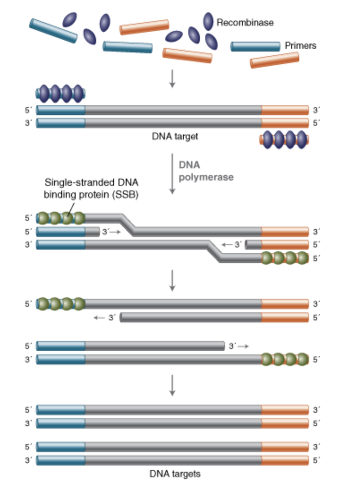
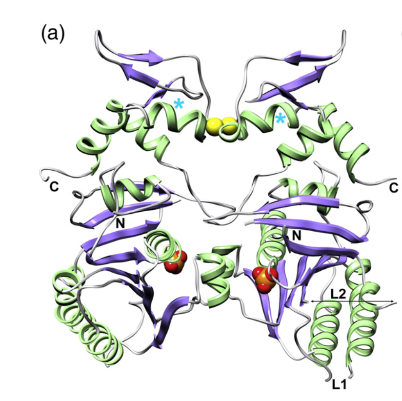

# Introduction 3000 words

## The need for portable DNA diagnostics
Rapid nucleic acid detection is essential for clinical diagnostics, disease surveillance, and environmental monitoring. However, conventional molecular diagnostic workflows often require centralised laboratory infrastructure, specialised equipment, and trained personnel, limiting their deployment in field-based and resource-limited settings.

The development of portable diagnostic platforms aims to overcome these limitations by enabling rapid molecular testing directly at the point of need. Such technologies have the potential to improve outbreak response, support environmental monitoring, and expand access to molecular diagnostics beyond traditional laboratory environments. Achieving this requires amplification methods that maintain high sensitivity while operating with minimal equipment.

## What is Recombinase Polymerase Amplification (RPA)
Before the development of nucleic acid amplification technologies, infectious disease diagnosis primarily relied on clinical symptoms, microscopy, immunological assays, and microbial culture-based methods. However, these approaches often lacked accuracy, sensitivity, required time-consuming workflows, or depended on the ability to successfully culture the target organism. The development of polymerase chain reaction (PCR) represented a major advancement in molecular diagnostics by enabling the rapid and highly sensitive amplification of specific DNA sequences from minimal starting material. PCR remains the gold standard nucleic acid amplification method due to its high analytical sensitivity, specificity, and robustness across a wide range of diagnostic applications.

Despite its widespread adoption, PCR requires repeated thermal cycling between different temperatures for DNA denaturation, primer annealing, and extension. This dependence on specialised thermocycling equipment increases assay complexity, limits portability, and can restrict deployment in resource-limited or point-of-care settings. These limitations have driven the development of alternative amplification technologies that retain the sensitivity of PCR while reducing equipment requirements.

Recombinase polymerase amplification (RPA) is a rapid, highly sensitive isothermal DNA amplification method that enables nucleic acid detection without the need for thermal cycling or complex laboratory equipment (Piepenburg, 2006). By combining recombinase-mediated primer targeting with strand-displacing DNA polymerase activity, RPA achieves exponential amplification at low, constant temperatures and can detect very low concentrations of target DNA. These characteristics make RPA well suited for portable diagnostics and point-of-care applications, with the potential to overcome key limitations associated with conventional PCR-based testing.

Despite these advantages, current RPA systems still require controlled incubation temperatures, typically between 37–42°C, meaning that external heating remains necessary. This requirement represents a remaining barrier to truly equipment-free molecular diagnostics. Since amplification efficiency depends on the temperature-dependent activity of the RPA enzymes, particularly the recombinase UvsX, identifying naturally occurring cold-adapted UvsX orthologues represents a potential strategy for extending RPA activity towards ambient temperatures (~20–25°C).

## How RPA works
Recombinase polymerase amplification (RPA) is an isothermal DNA amplification technique that combines recombinase-mediated primer targeting with strand-displacing DNA synthesis. A typical RPA reaction contains the recombinase UvsX, its loading factor UvsY, the single-stranded DNA-binding protein gp32, and a strand-displacing DNA polymerase (Piepenburg, 2006).

Single-stranded DNA primers are designed to flank the target region and anneal to opposite strands of the template DNA, with their 3′ ends oriented toward the region to be amplified. In solution, gp32 binds strongly to single-stranded DNA, including primers, preventing premature secondary structure formation and nonspecific interactions. UvsY promotes the assembly of UvsX onto the primers by facilitating displacement of gp32 and stabilising the formation of ATP-bound UvsX–DNA nucleoprotein filaments as seen in figure 1.

These nucleoprotein filaments actively scan double-stranded DNA for homologous sequences through transient, ATP-dependent interrogation of short base segments. Upon identification of sufficient sequence complementarity, the filament promotes strand invasion, displacing the complementary strand and forming a displacement loop (D-loop). gp32 binds the displaced single strand, stabilising the intermediate and preventing branch migration-mediated dissociation.

ATP hydrolysis regulates UvsX filament dynamics, promoting disassembly after successful strand invasion and thereby exposing the primer 3′ end. This allows a strand-displacing DNA polymerase (commonly the large fragment of Bacillus subtilis DNA polymerase I) to extend the primer. Repeated cycles of filament formation, strand invasion, and primer extension lead to exponential amplification of the target sequence under isothermal conditions (Lobato, 2018).

Because successful amplification depends on dynamic processes including UvsX filament assembly, DNA homology searching and strand invasion, changes in protein flexibility and conformational dynamics may influence the temperature range over which RPA remains efficient.

**Figure 1. Overview of recombinase polymerase amplification (RPA).**  
Schematic representation of the RPA mechanism. UvsX recombinase binds single-stranded primers and facilitates their invasion into homologous double-stranded DNA regions. Following primer binding, strand displacement synthesis by polymerase enables rapid DNA amplification under isothermal conditions without the need for thermal cycling.

### RPA vs PCR comparison

| Feature | Recombinase Polymerase Amplification (RPA) | Polymerase Chain Reaction (PCR) |
|---|---|---|
| **Temperature requirement** | Isothermal amplification performed at a constant low temperature (~37–42°C) | Requires repeated thermal cycling between denaturation, annealing, and extension temperatures |
| **Equipment requirements** | Minimal equipment; can be performed using simple heating devices, enabling portable and point-of-care applications | Requires a specialised thermocycler, limiting portability |
| **Amplification speed** | Rapid amplification, typically producing detectable products within ~20–40 minutes | Generally slower due to multiple thermal cycling steps |
| **Sensitivity** | Highly sensitive and capable of detecting low concentrations of target nucleic acids | Highly sensitive, particularly when combined with quantitative PCR (qPCR) |
| **Specificity** | Can tolerate some primer-template mismatches, which may increase the risk of non-specific amplification | Generally higher specificity due to strict primer annealing requirements and controlled thermal cycling |
| **Quantification capability** | Primarily qualitative or semi-quantitative due to rapid amplification kinetics | Excellent quantitative capability when using qPCR approaches |
| **Primer design** | Relatively simple but still requires optimisation to minimise non-specific amplification | Well-established primer design principles and extensive optimisation tools available |
| **Applications** | Point-of-care diagnostics, field pathogen detection, environmental monitoring, and resource-limited settings | Clinical diagnostics, research applications, pathogen detection, and molecular biology workflows |

Table 1. Summary of the comparative advantages and limitations of recombinase polymerase amplification (RPA) and polymerase chain reaction (PCR).

### Why Cold adapted orthologs would revolutionize DNA diagnostics.
Although RPA eliminates the need for thermal cycling, current reactions are typically performed at 37–42 °C to ensure optimal activity of the recombinase and polymerase enzymes. While this temperature is considerably lower than that required for PCR, it still necessitates an external heat source, limiting the deployment of RPA in truly equipment-free settings. Developing an RPA system capable of operating efficiently at ambient temperatures would represent a significant advancement for point-of-care molecular diagnostics.

One potential strategy is the identification of cold-adapted UvsX orthologues from psychrophilic organisms. Psychrophilic proteins have evolved to maintain high catalytic activity at low temperatures through increased structural flexibility, allowing them to overcome the reduced molecular motion associated with cold environments. If these adaptations are conserved in recombinase orthologues, they may enable efficient homology searching, strand invasion and primer targeting at room temperature without compromising amplification efficiency.

An ambient-temperature RPA system would further reduce the equipment requirements of nucleic acid amplification by removing the need for incubators or portable heating devices. This would simplify testing in resource-limited settings, facilitate field-based pathogen surveillance, improve environmental DNA (eDNA) monitoring, and enable rapid diagnostics during disease outbreaks where laboratory infrastructure is unavailable. Lower operating temperatures may also reduce power consumption, increase assay portability and simplify integration into disposable diagnostic devices.

This project therefore investigates naturally occurring cold-adapted UvsX orthologues as a means of extending the operational temperature range of RPA. By identifying recombinases that retain activity at ambient temperatures, this work aims to contribute towards the development of a truly portable DNA amplification platform capable of delivering rapid and sensitive molecular diagnostics outside of conventional laboratory environments.

## UvsX
UvsX is a recombinase protein encoded by bacteriophage T4 that plays a central role in homologous recombination. The protein is 391 amino acids in length and belongs to the RecA-like family of ATP-dependent recombinases. UvsX is evolutionarily related to the bacterial recombinase RecA, sharing a common RecA-like structural fold and conserved functional mechanisms involved in homologous recombination. Similar to RecA, UvsX forms ATP-dependent nucleoprotein filaments on single-stranded DNA (ssDNA), which mediate the search for homologous sequences within double-stranded DNA (dsDNA) and facilitate strand exchange.

Among the components of the RPA reaction, UvsX represents a particularly attractive target for optimisation because recombinase-mediated filament formation and strand invasion constitute the first rate-limiting steps of amplification. Improving UvsX activity under reduced thermal conditions could therefore increase the operational range of the entire reaction.

### ATP binding domains
ATP hydrolysis controls the dynamic assembly and disassembly of UvsX-DNA filaments, mutations affecting ATP-binding regions could alter recombinase activity and therefore influence amplification efficiency.

#### Walker A motif
The Walker A motif, also known as the P-loop, is a conserved phosphate-binding region responsible for ATP binding. In UvsX, the Walker A motif is located at residues 59–67 and corresponds to residues 65–73 in RecA. Structural comparison between UvsX and RecA demonstrates conservation of this motif in both position and residue composition, indicating preservation of the ATP-binding architecture. The Walker A motif interacts with the phosphate groups of ATP and provides the primary nucleotide-binding site within the ATPase domain (Gajewski, 2011).

#### Walker B motif
The Walker B motif of UvsX is located at residues 138–143 and corresponds to residues 139–144 in RecA. This motif contains a conserved aspartic acid residue (Asp143 in UvsX), which coordinates the Mg²⁺ ion required for ATP hydrolysis. Additionally, the catalytic glutamic acid residue (Glu92 in UvsX; equivalent to Glu96 in RecA) is conserved and contributes to ATP hydrolysis. Conservation of these catalytic residues indicates that UvsX retains the characteristic ATP-dependent mechanism of RecA-like ATPases (Gajewski, 2011).

### DNA binding loops
DNA binding requires conformational rearrangement of flexible loop regions, these regions may represent potential contributors to temperature-dependent changes in recombinase activity.

UvsX interacts with both ssDNA and dsDNA through conserved DNA-binding loops located within the core RecA-like domain. Despite relatively low sequence conservation between UvsX and RecA, the overall folding of the core domain is highly conserved, including the presence of two DNA-binding loops, L1 and L2. These flexible loops mediate interactions with DNA and are positioned to stabilise nucleic acid binding within the UvsX nucleoprotein filament. Structural studies of RecA-like recombinases suggest that these loops undergo conformational flexibility to accommodate DNA, with each UvsX monomer interacting with approximately three nucleotide or DNA base pairs (Pan, 2023).

The N-terminal and C-terminal regions of UvsX primarily contribute to oligomerisation and filament formation rather than directly contacting DNA. These domains interact with the core domain to stabilise the recombinase filament, creating the appropriate architecture for DNA binding and homologous pairing. Through coordinated action of the core DNA-binding loops and filament-forming regions, UvsX is able to bind ssDNA and facilitate homology searching against dsDNA during strand exchange (Ando, 1998).

**Figure 2. Crystal structure of the UvsX dimer highlighting the RecA-like ATPase domain and DNA binding Loops.**  
The dimeric arrangement of UvsX showing the conserved RecA-like core domain and the location of the ATP-binding sites at the dimer interface. The positions of the N- and C-terminal regions and the DNA-binding loops L1 and L2 are indicated, highlighting the structural organisation of the domains involved in ATP-dependent recombination and DNA binding.

## Thermal adaption
Temperature is a fundamental determinant of protein function, influencing both the rate of biochemical reactions and the structural dynamics required for catalysis. As temperature decreases, molecular motion is reduced, resulting in fewer productive collisions between enzymes and their substrates and an increase in the energetic barriers associated with conformational change. Enzyme catalysis depends on the ability of proteins to undergo precise structural rearrangements that position catalytic residues, orient substrates correctly, and stabilise the high-energy transition state intermediate formed during a chemical reaction. By reducing the activation energy required to reach this transition state, enzymes accelerate reaction rates; therefore, reduced conformational flexibility at low temperatures can limit catalytic efficiency. Organisms inhabiting permanently cold environments have consequently evolved proteins that maintain sufficient flexibility and catalytic activity despite reduced thermal energy.

Protein thermal adaptation is governed by a fundamental trade-off between catalytic activity and structural stability. Thermophilic proteins maximise stability through extensive intramolecular interactions, including increased hydrophobic packing, hydrogen bonding, and salt bridge formation, enabling them to resist thermal unfolding at elevated temperatures. Maintaining a stable folded structure is essential because protein function depends on the precise three-dimensional arrangement of amino acid residues that form active sites and interaction surfaces. Thermal unfolding disrupts these structural features, resulting in loss of enzymatic activity and potentially irreversible aggregation. In contrast, psychrophilic proteins have evolved to favour catalytic efficiency over stability, allowing them to remain highly active at low temperatures through increased structural flexibility while becoming more susceptible to thermal denaturation. This activity–stability trade-off is considered a defining characteristic of enzyme thermal adaptation.

Early models proposed that psychrophilic enzymes achieved this increased activity through enhanced flexibility of the active site, allowing catalytic residues to undergo the conformational changes required for catalysis despite reduced thermal energy. However, advances in molecular dynamics simulations and computational enzymology have challenged this hypothesis. Comparative studies of psychrophilic, mesophilic and thermophilic citrate synthases demonstrated the expected differences in activation thermodynamics but found little evidence that active-site residues themselves exhibited greater atomic fluctuations. Instead, the reduction in activation enthalpy (\Delta H^{\ddagger}) originated predominantly from regions outside the active site, suggesting that cold adaptation is driven by changes in the global dynamics of the protein rather than local increases in catalytic-site flexibility (Åqvist, 2017).

Current evidence therefore supports the view that psychrophilic enzymes possess altered conformational energy landscapes rather than simply more flexible active sites. Structural adaptations, including reduced hydrophobic packing, fewer stabilising electrostatic interactions and subtle amino acid substitutions, increase the mobility of loops, domain interfaces and other regions distant from the catalytic centre. These long-range dynamic changes lower the energetic cost of the conformational rearrangements required during catalysis while preserving the precise geometry of the catalytic residues. Consequently, the active site remains highly conserved and structurally competent, whereas the surrounding protein scaffold provides the flexibility necessary to maintain efficient catalysis at low temperatures.

These principles are particularly relevant to recombinase proteins such as UvsX. Unlike many metabolic enzymes, UvsX functions through a series of ATP-dependent conformational transitions that drive nucleoprotein filament assembly, homologous DNA searching, strand invasion, ATP hydrolysis and filament disassembly. The efficiency of these processes depends not only on the integrity of the ATP- and DNA-binding sites but also on coordinated structural dynamics throughout the protein. It is therefore plausible that cold-adapted UvsX orthologues have evolved modifications to their global conformational dynamics that permit efficient recombinase activity at lower temperatures without substantially altering the conserved functional regions responsible for ATP binding or DNA recognition.

Identifying such cold-adapted orthologues could extend the operational temperature range of recombinase polymerase amplification by enabling efficient strand invasion and primer targeting at ambient temperatures. This would further reduce the equipment requirements of RPA, improving its suitability for portable molecular diagnostics, field-based environmental monitoring and point-of-care testing in resource-limited settings.

**Figure 3. Thermal ranges of organisms and associated protein adaptations.**  
Comparison of the environmental temperature ranges occupied by psychrophilic, mesophilic, and thermophilic organisms. Cold-adapted proteins from psychrophilic organisms exhibit structural adaptations that maintain catalytic activity and flexibility at reduced temperatures, providing a potential source of enzymes for low-temperature biotechnological applications.

## Computational bioprospecting of UvsX orthologues
The rapid expansion of genomic and metagenomic datasets has enabled computational bioprospecting, where bioinformatic approaches are used to explore biological diversity and identify proteins with potentially valuable functional properties. By screening previously unexplored genetic resources, including extremophilic microbial communities, computational approaches provide a route to discovering novel biomolecules beyond experimentally characterised systems.

For the discovery of temperature-adapted UvsX recombinases, experimentally validated proteins provide essential references for identifying sequence and structural features associated with functional activity. The bacteriophage T4 UvsX recombinase represents the canonical member of this family due to its established role in homologous recombination and extensive biochemical characterisation. Additionally, the recently characterised UvsX$_t$ (7Z3M) and UvsX$_p$ (9GBG) orthologues, identified from extremophilic phages through the Virus-X project, demonstrate functional diversity across phage lineages while retaining conserved RecA-like ATPase and DNA-binding features (Tarrant, 2026).

Together, these characterised UvsX proteins provide reference points for computational pipelines designed to identify novel recombinases with potentially altered temperature adaptations. Comparing candidate sequences against experimentally validated examples enables the prioritisation of proteins with characteristics consistent with functional UvsX activity.

## Current limitations of RPA
Although recombinase polymerase amplification (RPA) offers rapid amplification, high analytical sensitivity and minimal equipment requirements, several limitations currently restrict its widespread adoption. RPA tolerates primer-template mismatches, this increased mismatch tolerance reduces assay specificity. Consequently, background DNA present in complex biological samples may undergo unintended amplification, increasing the likelihood of false-positive results in diagnostic applications (Rohrman, 2015).

While RPA is generally more resistant to common PCR inhibitors and can therefore be applied to less purified samples, its performance is highly dependent on careful optimisation of reaction conditions. The amplification process relies on a coordinated interaction between the recombinase UvsX, the loading factor UvsY, gp32 single-stranded DNA-binding protein and a strand-displacing DNA polymerase. Small changes in enzyme concentration, primer design or reaction chemistry can significantly affect amplification efficiency and increase the risk of non-specific products (Oliveira, 2021).

Although primer design is simpler than in other isothermal amplification techniques such as loop-mediated isothermal amplification (LAMP), dedicated primer design software remains limited and assay optimisation is often empirical, however there have been recent progress made at the Emergent Bioinformatics Lab who have released PrimedRPA to address this issue (Rabiu, 2026; Higgins, 2017). Furthermore, unlike quantitative PCR (qPCR), RPA provides relatively poor quantitative discrimination because amplification begins almost immediately after the reaction is initiated, making precise quantification challenging. As a result, RPA is predominantly used as a qualitative or semi-quantitative diagnostic technique (Tan, 2022).

Practical considerations also limit wider implementation. Commercial RPA reagents remain relatively expensive owing to proprietary enzyme formulations, and fewer commercial kits are available compared with the extensive range of PCR assays. Consequently, despite its advantages of rapid amplification (typically within 20–40 minutes), low operating temperature (37–42 °C) and minimal equipment requirements, RPA has yet to achieve the widespread adoption of PCR in routine diagnostic laboratories.

Many of these limitations arise from the biochemical properties of the recombinase machinery itself. Consequently, identifying naturally occurring recombinase orthologues with altered biochemical characteristics represents a promising strategy for improving the robustness and versatility of RPA. In particular, cold-adapted UvsX orthologues may retain high recombinase activity at lower temperatures, enabling efficient DNA amplification at ambient conditions without compromising reaction performance. Such an advance would further reduce the equipment requirements of RPA, increasing its suitability for point-of-care diagnostics, field-based testing and resource-limited settings.

### Aims & Objectives
The development of ambient-temperature RPA requires the identification of recombinase enzymes capable of maintaining efficient DNA strand exchange under reduced thermal conditions. This project aims to identify and characterise cold-adapted UvsX orthologues with the potential to extend the operational temperature range of RPA-based DNA amplification.

To achieve this aim, the following objectives will be addressed:

1. Identify candidate cold-adapted UvsX orthologues from publicly available sequence databases.
    Experimentally validated UvsX sequences will be used as reference standards to discover putative orthologues across diverse phage and microbial lineages.
2. Develop an in silico screening pipeline to prioritise candidate UvsX proteins.
    Candidate sequences will be evaluated using profile-based and sequence-based approaches, including hidden Markov models (HMMs), alongside computational predictors of protein adaptation and thermal preference.
3. Evaluate the structural dynamics of candidate UvsX orthologues.
    Molecular dynamics simulations will be used to investigate protein flexibility, stability, and conformational behaviour, identifying structural characteristics associated with cold adaptation.

Together, these approaches aim to establish a computational framework for discovering cold-adapted UvsX enzymes and identifying promising candidates for future experimental validation in low-temperature RPA systems.
This project therefore develops a computational pipeline to discover and characterise cold-adapted UvsX candidates with potential applications in next-generation ambient-temperature RPA systems.

# References
Åqvist, J., Isaksen, G.V. and Brandsdal, B.O., 2017. Computation of enzyme cold adaptation. Nature Reviews Chemistry, 1(7), p.0051.

Ando, R.A. and Morrical, S.W., 1998. Single-stranded DNA binding properties of the UvsX recombinase of bacteriophage T4: binding 

Gajewski, S., Webb, M.R., Galkin, V., Egelman, E.H., Kreuzer, K.N. and White, S.W., 2011. Crystal structure of the phage T4 recombinase UvsX and its functional interaction with the T4 SF2 helicase UvsW. Journal of molecular biology, 405(1), pp.65-76.

Lobato, I.M. and O'Sullivan, C.K., 2018. Recombinase polymerase amplification: Basics, applications and recent advances. Trac Trends in analytical chemistry, 98, pp.19-35.

Oliveira, B.B., Veigas, B. and Baptista, P.V., 2021. Isothermal amplification of nucleic acids: The race for the next “gold standard”. Frontiers in Sensors, 2, p.752600.

Pan, Y., Xie, N., Zhang, X., Yang, S. and Lv, S., 2023. Computational insights into the dynamic structural features and binding characteristics of recombinase UvsX compared with RecA. Molecules, 28(8), p.3363.

Piepenburg, O., Williams, C.H., Stemple, D.L. and Armes, N.A., 2006. DNA detection using recombination proteins. PLoS biology, 4(7), p.e204.

Rohrman, B. and Richards-Kortum, R., 2015. Inhibition of recombinase polymerase amplification by background DNA: a lateral flow-based method for enriching target DNA. Analytical chemistry, 87(3), pp.1963-1967.

Tan, M., Liao, C., Liang, L., Yi, X., Zhou, Z. and Wei, G., 2022. Recent advances in recombinase polymerase amplification: Principle, advantages, disadvantages and applications. Frontiers in Cellular and Infection Microbiology, 12, p.1019071.

Tarrant, E., Cormack, I.G., Hunter, C.E., Werbowy, O., Dorawa, S., Wang, L., Steen, I.H., Sandaa, R.A., Guðmundsdóttir, E.E., Ketelsen-Striberny, B. and Kaczorowska, A.K., 2026. Structure, function, and applications of two novel phage recombinases from extreme environments. Nucleic acids research, 54(4), p.gkag069.