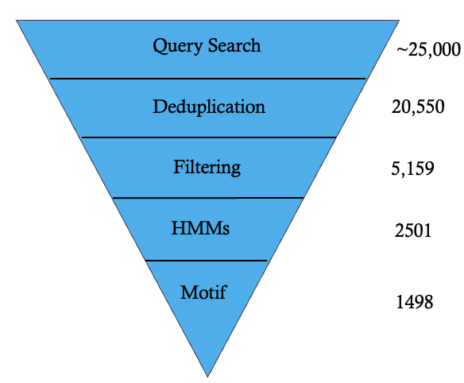
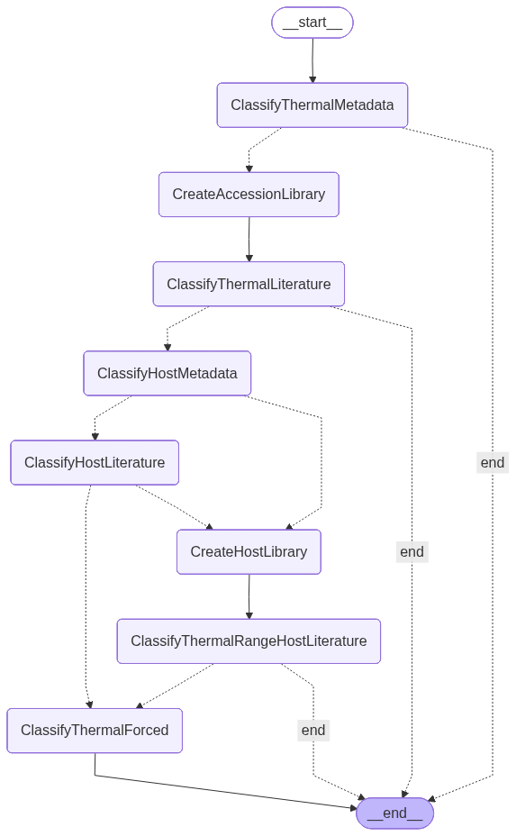
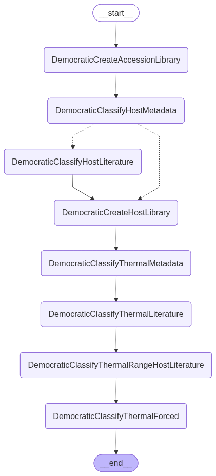
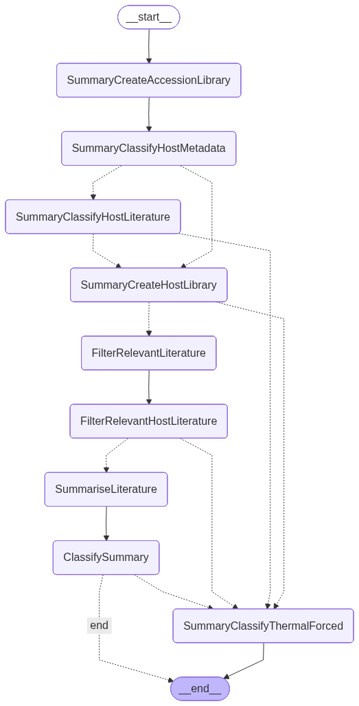

# Methods

## Selection of gold standard proteins

Experimentally characterised UvsX proteins were first identified to establish reference sequences for candidate discovery and downstream validation. These proteins provided experimentally supported examples of UvsX proteins with known functionality, thermal characteristics and available structural information.

The primary reference sequence was bacteriophage T4 UvsX, the recombinase utilised in conventional recombinase polymerase amplification (RPA). Additional validated UvsX orthologues were selected based on their experimentally characterised thermal adaptation properties. These included 7Z3M, a thermophilic UvsX orthologue, and 9GBG, a psychrophilic UvsX orthologue.

The engineered K35G/E198R UvsX variant was also included as a representative directed-evolution-derived protein exhibiting enhanced catalytic activity. Other engineered variants from the same study were excluded to avoid overrepresentation of highly similar sequences differing only by individual amino acid substitutions.

The resulting set of four gold standard proteins was used to guide downstream sequence-based screening, including HMM construction, conserved motif identification and structural comparison.

## Construction of a curated UvsX sequence database

A comprehensive database of candidate UvsX-like proteins was constructed using three publicly available protein resources: UniProt, NCBI, and InterPro. Candidate sequences were retrieved using database-specific search strategies designed to identify putative UvsX recombinase homologues. For UniProt and NCBI, keyword-based searches were performed using terms associated with UvsX and phage recombinase proteins. To complement these searches, the two InterPro entries associated with UvsX were queried through the InterPro API to retrieve all proteins annotated with the corresponding domains. All Databases were queried in April 2026

For every retrieved sequence, the associated protein sequence and available metadata, including accession identifiers, organism information and taxonomic identifiers, were collected. Sequences obtained from each source were combined into a single candidate database before undergoing a series of curation and filtering steps to identify high-confidence UvsX orthologues.

## Sequence database curation and redundancy removal

The combined database was first curated to remove redundant entries while preserving biologically meaningful diversity. Duplicate accession identifiers were removed to ensure that each database record was represented only once.

To further reduce redundancy, protein sequences were grouped according to amino acid identity. Within each group, taxonomic identifiers were used to distinguish proteins originating from the same species from those originating from different species. Where identical sequences originated from the same species, only a single representative sequence was retained. Identical sequences originating from different species were preserved to maintain taxonomic and evolutionary diversity for downstream analyses.

The resulting non-redundant sequence set was subsequently subjected to sequence quality filtering.

## Sequence length filtering

Following redundancy removal, candidate proteins were filtered based on sequence length to remove likely annotation artefacts and incomplete protein models. The filtering thresholds were selected relative to the experimentally characterised T4 UvsX recombinase, which consists of 391 amino acids.

Proteins shorter than 326 amino acids or longer than 426 amino acids were excluded from further analysis. This range was selected to retain proteins comparable in size to characterised UvsX recombinases while reducing the inclusion of incomplete or incorrectly annotated sequences.


## Identification of candidate UvsX orthologues using profile- and motif-based screening

A multi-stage screening framework was developed to identify high-confidence UvsX orthologues from the curated sequence database. Candidate proteins were evaluated using a combination of Hidden Markov Models (HMMs) and conserved ATP-binding motif identification.

### Hidden Markov model construction

Three Hidden Markov Models (HMMs) were constructed using HMMER3.

The first HMM was generated from the curated Pfam seed alignment corresponding to the conserved UvsX ATPase domain (PF00154) using the `hmmbuild` function.

Two custom HMMs were generated using experimentally characterised UvsX proteins. The first was constructed from a multiple sequence alignment of the four gold standard proteins. The second was generated by identifying the conserved Pfam domain regions within the gold standard proteins, extracting these regions, aligning them, and constructing a profile HMM from the resulting alignment.

Each HMM was used to search the filtered sequence database, and significant matches were retained for downstream candidate evaluation.

### Conserved ATP-binding motif identification

In addition to profile-based screening, candidate proteins were assessed for the presence of conserved ATP-binding motifs characteristic of RecA-family recombinases.

The Walker A motif was identified using a regular expression representing the conserved P-loop nucleotide-binding motif. To accommodate sequence variation within UvsX proteins, the search pattern was adapted to account for the phenylalanine residue present within the T4 UvsX motif:

```
Gxxxx[G/F]K[T/S]
```

The Walker B motif was identified using the conserved hydrophobic residue pattern:

```
hhhh[D/E]
```

where *h* represents any hydrophobic amino acid.

DNA-binding regions were not included within the screening framework due to the absence of a conserved sequence motif and their predominantly structural mode of conservation. Instead, conserved ATP-binding motifs were used as functional sequence markers to increase confidence that identified candidates possessed the molecular features required for UvsX recombinase activity.

### Candidate selection

Each candidate protein was represented by a binary feature vector describing the presence or absence of each screening criterion. The screening framework comprised:

- Three Hidden Markov Model matches
- Walker A motif presence
- Walker B motif presence

Only proteins satisfying all five criteria were retained as high-confidence UvsX orthologues. These proteins formed the candidate dataset used for downstream thermal prediction, literature-based thermal classification, structural modelling and molecular dynamics simulations.

The complete database construction and candidate selection workflow is summarised in Figure X. Approximately 25,000 protein sequences were initially retrieved from public databases. Following redundancy removal, sequence length filtering, HMM screening and motif-based filtering, 1,498 high-confidence UvsX candidates were retained for downstream analyses.


**Figure X.** Computational workflow used to construct the curated UvsX database and identify high-confidence candidate orthologues. Candidate proteins were retrieved from UniProt, NCBI and InterPro before undergoing redundancy removal, sequence length filtering, Hidden Markov Model screening and conserved motif identification. Proteins satisfying all screening criteria were retained for downstream analyses.


## Prediction of protein thermal optima
Predicted optimal temperatures (Topt) were generated using Seq2Topt, an ab initio machine learning model that predicts enzyme thermal optima directly from amino acid sequence information.
Predictions were generated for high-confidence candidate sequences identified through the scoring framework.
These predictions were subsequently used alongside literature-derived thermal classifications to investigate relationships between sequence-derived thermal predictions and experimentally reported thermal adaptations.


## Phylogenetic analysis
Phylogenetic analysis was performed to investigate evolutionary relationships between candidate sequences and experimentally characterised UvsX proteins.
Selected candidate sequences were aligned using multiple sequence alignment. MAFFT was initially evaluated for sequence alignment; however, due to computational limitations associated with the dataset size, FAMSA was used for large-scale alignment generation.
Resulting alignments were filtered using trimAl to remove low-confidence alignment regions prior to downstream phylogenetic analysis.

![I never did anything with the database alignments of phylogentic trees in the end but have them in the repo + IToL]


## Agentic literature retrieval and thermal classification pipeline
While Seq2Topt provides ab-initio thermal predictions, experimentally validated evidence describing protein thermal adaptation remains scattered throughout the scientific literature. To integrate this evidence into the discovery pipeline, the Thermophile–Mesophile–Psychrophile (TMP) classification pipeline was developed to identify experimentally reported evidence describing the thermal adaptation of candidate proteins and their associated host organisms. The pipeline derives its name from the three thermal adaptation classes it predicts: thermophile, mesophile and psychrophile.

The workflow accepts NCBI protein accession identifiers as input and automatically retrieves associated metadata from NCBI resources. Metadata extracted includes protein annotations, organism information, taxonomic identifiers and linked scientific publications. Where available, publications directly associated with the queried protein accession are retrieved for analysis. If insufficient literature is associated with the accession, an additional literature search is automatically performed using a search query generated from the available protein and organism metadata to identify further relevant publications. In parallel, the pipeline performs organism-level analysis by identifying the source organism of each protein and retrieving publications associated with the host organism to provide additional evidence for thermal classification.

Retrieved literature is processed using large language models to identify experimentally reported growth temperatures, environmental conditions and other evidence indicative of thermal adaptation. Depending on the pipeline implementation, this evidence is analysed either directly from individual publications or after an intermediate evidence synthesis stage. The extracted information is subsequently used to assign each protein to one of three thermal adaptation classes: psychrophilic, mesophilic or thermophilic.

To evaluate the effectiveness of different agentic reasoning strategies, a benchmark dataset was constructed comprising protein accession identifiers from bacteriophages with experimentally established thermal adaptations. Organisms were selected through manual literature curation to represent psychrophilic, mesophilic and thermophilic phages, and representative protein accession identifiers from these organisms were compiled into a labelled validation dataset. This benchmark enabled quantitative comparison of multiple pipeline architectures against known thermal classifications.

Three iterative versions of TMP were developed and evaluated during software development.

### Fast implementation

The Fast implementation prioritised computational efficiency by terminating literature analysis once the first sufficiently convincing piece of evidence supporting a thermal classification was identified. To maximise the likelihood of analysing informative publications first, retrieved papers were ranked using a regular expression-based scoring system that counted the occurrence of predefined thermal adaptation keywords (e.g. psychrophilic, thermophilic, growth temperature, optimal temperature). Publications containing a greater number of matching terms were prioritised for analysis by the language model. While this substantially reduced inference time and computational cost, classifications remained dependent on a single publication and were therefore more susceptible to misleading, incomplete or contradictory evidence.


Figure X. Workflow of the Fast implementation.

### Democratic implementation

The Democratic implementation sought to improve robustness by independently analysing each retrieved publication associated with a protein or host organism. As with the Fast implementation, publications were first ranked using the regular expression-based keyword scoring system to prioritise the most informative literature. Each publication generated an independent thermal classification, with every paper contributing one vote towards the final prediction. The overall thermal classification was then determined using majority voting across all analysed publications. This approach reduced the influence of individual erroneous classifications while allowing conflicting evidence within the literature to be represented during decision making.


Figure X. Workflow of the Democratic implementation.

### Summary implementation

The final Summary implementation adopted a hierarchical reasoning strategy. Unlike the previous implementations, retrieved publications first underwent an automated relevance assessment to remove articles that contained little or no information relating to thermal adaptation. Relevant publications were then synthesised into a structured evidence summary describing the collective thermal characteristics reported across the literature. A final thermal classification was subsequently generated from this consolidated summary rather than from individual publications. By reasoning over an integrated body of evidence instead of isolated studies, this approach aimed to reduce inconsistencies arising from individual papers while enabling the language model to consider the complete evidence base before assigning a classification.


Figure X. Workflow of the Summary implementation.

The performance of each pipeline architecture was evaluated using the curated benchmark dataset, allowing the effect of different agentic reasoning strategies on thermal classification accuracy to be assessed. Literature-derived classifications were subsequently compared with sequence-based thermal predictions generated by the machine learning pipeline to determine the degree of agreement between evidence-based and sequence-based approaches. Together, these complementary analyses provided increased confidence in candidate selection by integrating experimental evidence from the scientific literature with computational predictions derived from protein sequence.


## Protein structure prediction and structural comparison

Structural models were generated for selected UvsX proteins using Boltz. Structural prediction was performed using amino acid sequences as input, with additional multiple sequence alignments supplied where appropriate.

Experimentally determined crystal structures of the gold standard proteins were used as structural references. Prior to structural comparison and molecular dynamics simulations, crystal structures were processed using PDBFixer to repair incomplete structural information, including missing residues and atoms, and to generate complete models suitable for downstream analyses.

To investigate strategies for improving Boltz structural predictions, several sequence preparation approaches were evaluated. These included predictions generated from full-length protein sequences and trimmed sequences corresponding to experimentally resolved structural regions. Multiple sequence alignments generated from UniRef100 using ColabFold, as well as custom alignments generated from high-confidence UvsX orthologues identified during the in silico screening workflow, were supplied as additional inputs to Boltz where appropriate.

Predicted structures were compared with experimentally determined crystal structures using US-align to assess structural similarity. AlphaFold-predicted structures were generated for the same proteins and evaluated using the same structural comparison workflow to benchmark prediction accuracy and identify the most suitable structural models for downstream molecular dynamics simulations.


## Molecular dynamics simulations

Molecular dynamics (MD) simulations were performed using GROMACS to investigate the structural stability and conformational dynamics of representative UvsX proteins.

Experimentally determined crystal structures of the gold standard proteins were simulated to provide reference trajectories for comparison. In addition, representative psychrophilic, mesophilic, and thermophilic UvsX orthologues identified through the Thermal Metadata Pipeline (TMP) were selected for simulation. Structural models for these orthologues were obtained from AlphaFold and prepared for molecular dynamics simulations. The K35G/E198R was not simulated due to high similarity to UvsX. 

### System preparation
Protein topologies were generated using the CHARMM27 force field with the TIP3P water model. Each protein was placed within a dodecahedral simulation box with a minimum distance of 1.0 nm between the protein and the box boundary. Systems were solvated, neutralised using potassium and chloride ions, and adjusted to a final ionic concentration of 0.10 M, to mimic RPA reaction conditions.

### Energy minimisation
Energy minimisation was performed using the steepest descent algorithm with a convergence criterion of 1000 kJ mol⁻¹ nm⁻¹ and a maximum of 500 minimisation steps before equilibration.

### Equilibration

Following minimisation, each system underwent sequential NVT and NPT equilibration.

Simulations were performed under three temperature conditions representing different thermal adaptation environments:

- Psychrophilic: 288 K
- Mesophilic: 310 K
- Thermophilic: 338 K

Temperature, pressure and system density were monitored throughout equilibration to confirm system stability before production simulations.

### Production molecular dynamics simulations

Production molecular dynamics simulations were performed using the equilibrated structures under the corresponding temperature conditions.

### Trajectory analysis

Simulation trajectories were processed to remove periodic boundary artefacts before analysis. Structural stability and protein dynamics were characterised using:

- Root mean square deviation (RMSD)
- Root mean square fluctuation (RMSF)
- Radius of gyration (Rg)
- Minimum intramolecular distance

These analyses were used to compare the structural stability and dynamic behaviour of the reference proteins and candidate UvsX orthologues under different thermal conditions.

# References