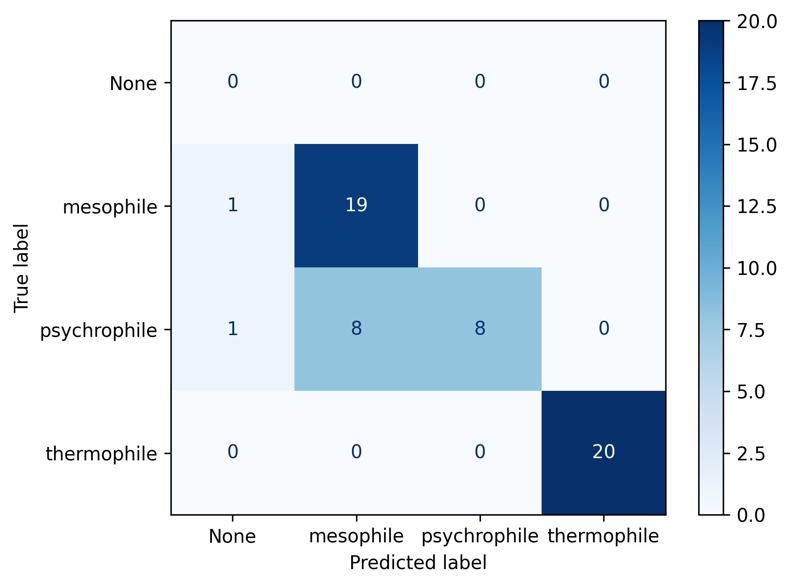
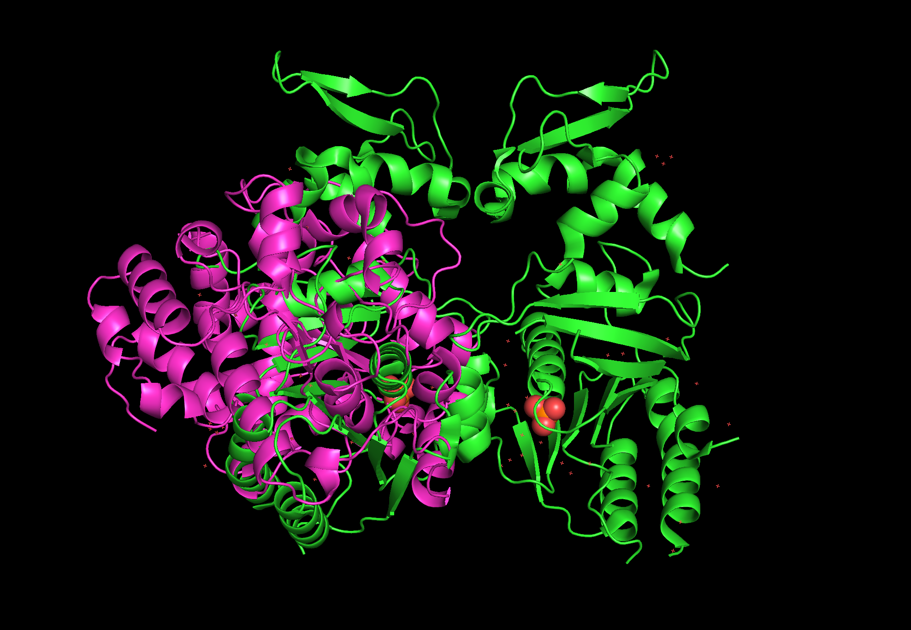
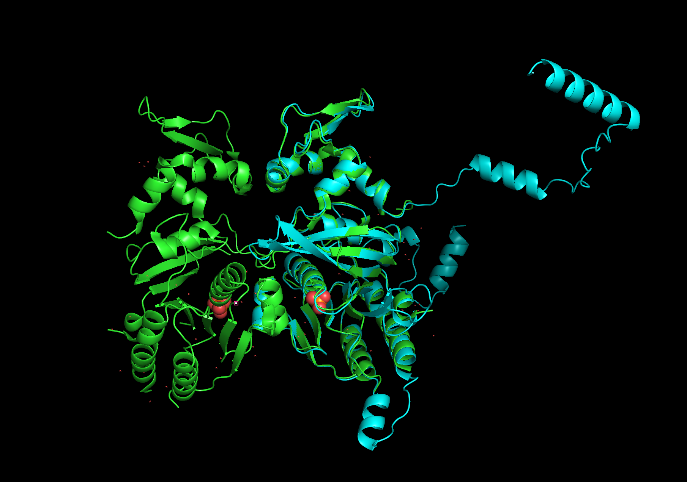

# Results

## 1. Identification of UvsX orthologues from sequence databases

### 1.1 Construction of the curated UvsX sequence dataset

Initial database searches across UniProt, NCBI and InterPro retrieved a total of 26,486 candidate protein sequences. Removal of duplicate accessions and redundant protein sequences reduced the dataset to 20,548 unique sequences.

Examination of the sequence length distribution revealed substantial variation in protein length, with numerous sequences considerably shorter or longer than experimentally characterised UvsX recombinases (Figure 8). These proteins were likely to represent incomplete protein models, annotation artefacts or non-UvsX homologs and were therefore excluded from further analysis using the predefined length filter of 326–426 amino acids.

Application of the sequence length filter reduced the dataset to 5,161 candidate proteins suitable for downstream screening.

The taxonomic composition of the dataset before and after sequence length filtering is shown in Figures 9 and 10. Although the total number of sequences was substantially reduced, the filtered dataset retained broad taxonomic diversity across bacteriophage families, indicating that the filtering strategy removed likely artefactual sequences while preserving biologically relevant diversity.

**Figure 8.** Distribution of protein sequence lengths following redundancy removal. Dashed lines indicate the sequence length thresholds (326–426 amino acids) applied to identify proteins comparable in size to experimentally characterised UvsX recombinases.

**Figure 9.** Taxonomic family distribution of the curated sequence database prior to sequence length filtering.

**Figure 10.** Taxonomic family distribution following sequence length filtering.

### 1.2 HMM-based identification of UvsX candidates

The filtered sequence dataset was screened using the three Hidden Markov Models constructed from experimentally characterised UvsX proteins and the conserved Pfam ATPase domain.

A total of 2,501 proteins matched all three Hidden Markov Models and were retained for subsequent motif-based screening. The overlap between the three HMMs is shown in Figure 11. The large intersection between all three models demonstrates substantial agreement between independently generated HMM profiles and supports their effectiveness for identifying conserved UvsX homologues.

**Figure 11.** Overlap between proteins identified by the three Hidden Markov Models. Proteins retained for downstream analysis were required to match all three HMM profiles.

### 1.3 Motif-based validation of candidate UvsX proteins

The 2,501 proteins identified through HMM screening were subsequently assessed for the presence of the conserved Walker A and Walker B ATP-binding motifs.

Application of the motif-based screening criteria reduced the candidate dataset to 1,498 proteins. These proteins satisfied every stage of the screening framework, including sequence length filtering, all three Hidden Markov Models and both conserved ATP-binding motif requirements.

The resulting dataset represents a high-confidence collection of putative UvsX orthologues that was used for all downstream thermal prediction, literature analysis, structural modelling and molecular dynamics simulations.

### 1.4 Characteristics of the final high-confidence UvsX dataset

The final high-confidence dataset comprised 1,498 candidate UvsX proteins spanning a broad range of bacteriophage families (Figure 12). Despite the stringent filtering strategy, substantial taxonomic diversity was retained, demonstrating that the screening framework was capable of identifying UvsX homologues across diverse evolutionary lineages.

The sequence length distribution of the final candidates was consistent with experimentally characterised UvsX proteins, with the majority of proteins falling within the expected size range (Figure 13). This confirms that the combined filtering strategy successfully enriched for proteins possessing the characteristic sequence features of UvsX recombinases while removing likely annotation artefacts and unrelated ATPase proteins.

**Figure 12.** Taxonomic family distribution of the 1,498 high-confidence UvsX candidate proteins.

**Figure 13.** Sequence length distribution of the final high-confidence UvsX candidate dataset.

# 2. Thermal prediction and classification of candidate UvsX proteins

## 2.1 Seq2Topt predicted thermal optima

Predicted optimal temperatures (Topt) were generated for all 1,498 high-confidence UvsX candidates using Seq2Topt. Predicted temperatures ranged from 30°C to 80°C, with a mean predicted optimal temperature of 43.1°C (Figure 14).

The distribution of predicted temperatures was centred around mesophilic conditions, with comparatively fewer candidates predicted to exhibit extreme psychrophilic or thermophilic thermal optima. This suggests that the majority of identified UvsX proteins are predicted to function within moderate temperature environments.

**Figure 14.** Distribution of Seq2Topt-predicted optimal temperatures for the 1,498 high-confidence UvsX candidate proteins.

To assess the suitability of Seq2Topt for predicting UvsX thermal adaptation, predictions for experimentally characterised reference proteins were compared with their known thermal characteristics. The thermophilic and psychrophilic reference proteins were predicted to have optimal temperatures of 46°C and 52°C, respectively, despite representing opposite extremes of thermal adaptation. 

These observations are consistent with the reported performance of Seq2Topt, which has a published root mean square error (RMSE) of approximately 12°C. The limited separation between experimentally characterised psychrophilic and thermophilic UvsX proteins indicated that sequence-based prediction alone was insufficient for reliable thermal classification. Consequently, the Thermophile–Mesophile–Psychrophile (TMP) pipeline was developed to investigate whether integrating experimentally reported evidence from the scientific literature could improve classification of protein thermal adaptation.

## 2.2 Thermal classification using TMP
To evaluate the performance of the Thermophile–Mesophile–Psychrophile (TMP) pipeline, a benchmark dataset comprising 60 proteins with experimentally established thermal adaptations was assembled.

The benchmark dataset consisted of 20 psychrophilic, 20 mesophilic, and 20 thermophilic proteins, providing a balanced dataset for evaluating classification performance across the three thermal adaptation classes.

The curated benchmark dataset was subsequently used to compare the performance of the Fast, Democratic and Summary implementations of TMP.

| Thermal classification | Number of proteins |
|------------------------|-------------------:|
| Psychrophilic          | 20 |
| Mesophilic             | 20 |
| Thermophilic           | 20 |
| **Total**              | **60** |

**Table 2.** Composition of the benchmark dataset used to evaluate the performance of the TMP thermal classification pipeline.

## 2.3 Comparison of TMP implementations

Three versions of the Thermophile–Mesophile–Psychrophile (TMP) pipeline were evaluated using the 60-protein benchmark dataset: Fast, Democratic and Summary.

The three implementations differed primarily in the amount of literature evidence incorporated before generating a final thermal classification. The Fast implementation prioritised computational efficiency by terminating analysis once sufficient evidence was identified. The Democratic implementation incorporated classifications from multiple publications using majority voting. The Summary implementation performed an intermediate evidence synthesis step before generating the final classification.

The computational time required to classify all 60 benchmark proteins differed substantially between the three approaches (Figure 15). The Fast implementation required the shortest runtime, while the Summary implementation required the greatest computational time due to the additional literature processing and evidence synthesis steps.

**Figure 15.** Total runtime required for each TMP implementation to classify the 60 benchmark proteins.

Classification performance was assessed using accuracy, precision, recall and F1-score. Across all three approaches, thermophilic proteins were classified with high confidence, whereas greater variation was observed between mesophilic and psychrophilic classifications.

### Fast TMP

The Fast implementation achieved an overall classification accuracy of 78% across the benchmark dataset (Figure 16). Thermophilic proteins were classified correctly in all cases (recall = 1.00), while psychrophilic proteins showed reduced recall (0.40), with several proteins incorrectly classified as mesophilic.

Although structured output constraints were implemented to restrict model responses to the predefined thermal classification categories, occasional invalid classifications were still generated during inference. These outputs required post-processing before evaluation, demonstrating the importance of additional validation steps when applying automated literature-based classification workflows.

**Figure 16.** Confusion matrix showing classification performance of the Fast TMP implementation on the benchmark dataset.

### Democratic TMP

The Democratic implementation improved overall classification accuracy to 80% (Figure 17). Similar to the Fast implementation, all thermophilic proteins were correctly identified, while psychrophilic proteins remained the most challenging class, with a recall of 0.40.

The increase in accuracy compared with the Fast implementation suggests that incorporating evidence from multiple publications reduced some classification errors. However, the persistence of misclassification between psychrophilic and mesophilic proteins indicated that majority voting alone was insufficient to fully resolve conflicting literature evidence.

**Figure 17.** Confusion matrix showing classification performance of the Democratic TMP implementation on the benchmark dataset.

### Summary TMP

The Summary implementation achieved the highest classification performance, with an overall accuracy of 90% (Figure 18). Thermophilic proteins were classified correctly in all cases (recall = 1.00), while psychrophilic and mesophilic classifications also improved compared with the previous approaches.

The largest improvement was observed for psychrophilic proteins, where recall increased from 0.40 in both the Fast and Democratic implementations to 0.70 in the Summary implementation. This suggests that synthesising evidence across multiple publications before classification reduced errors arising from individual conflicting studies.

Despite requiring the longest runtime, the Summary implementation provided the most accurate classification and was therefore selected as the final TMP workflow for downstream analysis of candidate UvsX proteins.

**Figure 18.** Confusion matrix showing classification performance of the Summary TMP implementation on the benchmark dataset.

**Figure 19.** Comparison of TMP workflow performance using classification metrics. Radar plot showing accuracy, macro-averaged precision, recall and F1-score for the Fast, Democratic and Summary implementations evaluated on the 60-protein benchmark dataset. Each axis represents a classification metric, with values normalised between 0 and 1. Higher values indicate improved performance across the benchmark dataset.

| TMP Implementation | Accuracy | Macro Precision | Macro Recall | Macro F1-score | Runtime (min) |
|--------------------|----------|-----------------|--------------|----------------|---------------|
| Fast               | 0.78     | 0.54            | 0.47         | 0.48           | 73.59         |
| Democratic         | 0.80     | 0.66            | 0.60         | 0.59           | 158.11        |
| Summary            | 0.90     | 0.92            | 0.90         | 0.90           | 210.05        |
**Table 3.** Comparison of TMP implementation performance on the 60-protein benchmark dataset. Classification metrics represent overall model performance across psychrophilic, mesophilic and thermophilic classes, while runtime indicates the computational time required to complete all classifications.

## 2.4 Agreement between TMP and Seq2Topt

To investigate the relationship between sequence-based thermal predictions and literature-derived thermal classifications, Seq2Topt-predicted optimal temperatures were compared with TMP classifications for the high-confidence UvsX candidate dataset.

**Figure 20.** Distribution of TMP-derived thermal classifications across the 1,498 high-confidence UvsX candidate proteins.

TMP classified the majority of candidate proteins as mesophilic, accounting for 98.6% of all predictions. Thermophilic and psychrophilic classifications represented a small proportion of the dataset, accounting for 0.8% and 0.6% of candidates, respectively.

To compare TMP classifications with sequence-based thermal predictions, Seq2Topt-predicted optimal temperatures were plotted according to TMP thermal categories (Figure 21). Candidates classified as psychrophilic by TMP exhibited lower predicted optimal temperatures compared with candidates classified as thermophilic, indicating that the two approaches identified consistent trends in thermal adaptation.

**Figure 21.** Distribution of Seq2Topt-predicted optimal temperatures grouped by TMP thermal classification.

Despite the strong enrichment of candidates within the mesophilic category, the distribution of Seq2Topt predictions showed overlap between thermal classes. This indicates that while TMP classifications and sequence-based predictions captured broad differences in thermal adaptation, predicted optimal temperatures alone were insufficient to clearly separate all thermal groups.

# 3. Structural prediction and validation of UvsX proteins

## 3.1 Comparison of structure prediction methods

Structural models generated using AlphaFold and Boltz were compared against experimentally determined crystal structures of the gold standard UvsX proteins using US-align. Structural similarity was assessed using TM-score normalised by the reference crystal structure together with root mean square deviation (RMSD).

| Protein | Prediction method | TM-score | RMSD (Å) |
|---------|-------------------|---------:|---------:|
| T4 UvsX | AlphaFold | 0.682 | 1.03 |
| T4 UvsX (PDB trimmed) | AlphaFold | 0.809 | 1.02 |
| T4 UvsX (SWISS trimmed) | AlphaFold | 0.849 | 1.09 |
| 7Z3M | AlphaFold | 0.770 | 1.89 |
| 9GBG | AlphaFold | 0.821 | 1.51 |
| T4 UvsX | Boltz | 0.251 | 6.63 |
| T4 UvsX (PDB trimmed) | Boltz | 0.255 | 5.94 |
| T4 UvsX (SWISS trimmed) | Boltz | 0.279 | 6.68 |
| 7Z3M | Boltz | 0.268 | 6.50 |
| 9GBG | Boltz | 0.262 | 5.86 |

**Table 4.** Structural similarity between predicted models and experimentally determined crystal structures measured using US-align. TM-scores are normalised by the length of the reference crystal structure.

AlphaFold consistently generated structural models with high similarity to the experimentally determined crystal structures. TM-scores ranged from 0.682 to 0.849, while RMSD values ranged from 1.02 Å to 1.89 Å, indicating close agreement between predicted and experimental structures.

For T4 UvsX, prediction accuracy improved when only the experimentally resolved region of the protein was modelled. The highest structural similarity was obtained using the SWISS-MODEL trimmed sequence, producing a TM-score of 0.849 and an RMSD of 1.09 Å. Similar agreement was observed for the thermophilic (7Z3M) and psychrophilic (9GBG) reference proteins, which achieved TM-scores of 0.770 and 0.821, respectively.

In contrast, Boltz predictions exhibited substantially lower agreement with the crystal structures. TM-scores ranged from 0.251 to 0.279, with RMSD values between 5.86 Å and 6.68 Å, indicating considerably poorer structural accuracy across all reference proteins.

These results demonstrate that AlphaFold consistently produced more accurate structural models of UvsX proteins than Boltz and was therefore selected as the primary structure prediction method for downstream analyses.

**Figure 22.** Comparison of predicted T4 UvsX structures with the experimentally determined crystal structure. The Boltz (top) and AlphaFold (bottom) predicted models were aligned against the reference crystal structure using US-align. Structural agreement was assessed using TM-score and RMSD values.

## 3.2 Effect of sequence input strategy on Boltz prediction

Several alternative sequence preparation strategies were evaluated to determine whether Boltz prediction accuracy could be improved. These included prediction from full-length protein sequences, trimmed sequences corresponding to experimentally resolved structural regions, UniRef100 multiple sequence alignments generated using ColabFold, and custom multiple sequence alignments generated from the curated UvsX candidate database.

| Input strategy | T4 UvsX | 7Z3M | 9GBG |
|----------------|---------:|-----:|-----:|
| Full-length sequence | 0.251 | 0.268 | 0.262 |
| Trimmed sequence | 0.279 | — | — |
| UniRef100 MSA | 0.293 | 0.269 | 0.266 |
| Custom UvsX MSA | 0.243 | 0.229 | 0.259 |

**Table 5.** Comparison of Boltz prediction strategies using TM-scores normalised by the reference crystal structure.

For T4 UvsX, both sequence trimming and incorporation of a UniRef100 multiple sequence alignment produced modest improvements in structural similarity compared with prediction from the full-length sequence. The highest TM-score obtained using Boltz was 0.293 when a UniRef100 multiple sequence alignment generated using ColabFold was supplied.

Supplying a custom multiple sequence alignment generated from the curated UvsX candidate database did not improve prediction accuracy and generally produced lower TM-scores than the UniRef100 alignment.

For the thermophilic (7Z3M) and psychrophilic (9GBG) reference proteins, only minimal differences were observed between the alternative prediction strategies, with all TM-scores remaining below 0.30. Overall, modifications to sequence preparation and multiple sequence alignment inputs were insufficient to substantially improve Boltz prediction accuracy for UvsX proteins.

# 4. Molecular dynamics analysis of UvsX thermal adaptation

Molecular dynamics simulations were performed to investigate whether computationally predicted UvsX structures were capable of reproducing experimentally observed structural behaviour. Prior to analysing candidate orthologues, experimentally characterised UvsX proteins were used as validation cases by comparing molecular dynamics trajectories generated from experimentally resolved crystal structures and corresponding AlphaFold predictions.

This validation step was performed to determine whether AlphaFold-generated models captured comparable patterns of structural stability, flexibility and global conformational behaviour to experimentally characterised proteins. Following this assessment, AlphaFold structures were used for molecular dynamics simulations of representative UvsX orthologues identified through the TMP classification pipeline.

# 4.1 Validation of AlphaFold structures using experimentally characterised UvsX proteins

## 4.1.1 Structural stability comparison using RMSD

Root mean square deviation (RMSD) was analysed to assess whether AlphaFold-predicted structures displayed comparable structural stability and equilibration behaviour to experimentally determined crystal structures.

The T4 UvsX protein was initially evaluated as the primary reference structure. Molecular dynamics simulations were performed for both the experimentally resolved crystal structure and the corresponding AlphaFold model under equivalent temperature conditions.

**Figure 24.** RMSD profiles comparing experimentally determined T4 UvsX crystal structure and AlphaFold-predicted structure during molecular dynamics simulations performed under equivalent temperature conditions.

The RMSD profiles of the T4 UvsX crystal structure and AlphaFold model displayed substantially different behaviours across all simulated temperatures. The experimentally determined structure remained highly stable, with mean RMSD values between 0.24–0.34 nm across the three temperature conditions. In contrast, the AlphaFold model exhibited greater structural deviation, with mean RMSD values ranging from 0.87–1.15 nm.

This difference is likely associated with structural differences between the two input models rather than inaccurate structure prediction. The experimentally resolved T4 UvsX structure represents a dimeric assembly, whereas the AlphaFold prediction corresponds to a single protein chain. Loss of intermolecular contacts and differences in structural constraints between the monomeric and dimeric states are therefore expected to influence molecular dynamics behaviour.

To determine whether this difference was specific to the T4 UvsX structural arrangement, an additional validation comparison was performed using the experimentally characterised 9GBG UvsX orthologue.

**Figure 25.** RMSD profiles comparing experimentally determined and AlphaFold-predicted 9GBG UvsX structures during molecular dynamics simulations.

Unlike T4 UvsX, the experimentally determined and AlphaFold-predicted 9GBG structures displayed highly similar RMSD behaviour. Across all simulated conditions, both structures showed comparable equilibration profiles and similar RMSD values. The experimentally determined structure exhibited mean RMSD values between 0.29–0.40 nm, while the AlphaFold model showed comparable values between 0.32–0.44 nm.

These results indicate that AlphaFold-generated structures can reproduce the overall dynamic stability of experimentally characterised UvsX proteins when comparable structural states are evaluated. The reduced agreement observed for T4 UvsX is therefore likely attributable to differences in oligomeric state rather than limitations of AlphaFold structure prediction.

## 4.1.2 Comparison of residue flexibility between predicted and experimental structures

Residue-level flexibility was assessed using root mean square fluctuation (RMSF) analysis to determine whether AlphaFold models reproduced experimentally observed patterns of protein mobility.

**Figure 26.** RMSF profiles comparing experimentally determined T4 UvsX crystal structure and AlphaFold-predicted structure during molecular dynamics simulations.

The RMSF profiles of T4 UvsX showed similar overall patterns between the crystal structure and AlphaFold prediction, with flexible and constrained regions occurring at comparable positions throughout the sequence. However, the magnitude of fluctuations differed substantially between the two structures.

The AlphaFold model displayed increased residue mobility compared with the crystal structure, with mean RMSF values ranging from 0.40–0.62 nm compared with 0.13–0.18 nm for the experimentally determined structure. These increased fluctuations are consistent with the RMSD observations and may result from the absence of stabilising intermolecular interactions present in the dimeric crystal structure.

**Figure 27.** RMSF profiles comparing experimentally determined and AlphaFold-predicted 9GBG UvsX structures during molecular dynamics simulations.

The 9GBG RMSF profiles demonstrated stronger agreement between experimental and predicted structures. Both structures displayed comparable flexibility patterns, with similar regions of increased and reduced mobility. Differences in average RMSF magnitude were smaller than those observed for T4 UvsX, with predicted structures showing only modestly increased flexibility.

Together, these results demonstrate that AlphaFold models reproduce the major dynamic features of experimentally characterised UvsX proteins, while absolute flexibility values may vary depending on structural context.

## 4.1.3 Comparison of global structural compactness

Radius of gyration (Rg) was analysed to evaluate whether AlphaFold structures maintained similar global compactness and conformational organisation to experimentally determined structures.

**Figure 28.** Radius of gyration profiles comparing experimentally determined T4 UvsX crystal structure and AlphaFold-predicted structure during molecular dynamics simulations.

The T4 UvsX AlphaFold model displayed differences in global compactness compared with the crystal structure. Under psychrophilic conditions, the predicted structure maintained a higher Rg throughout the simulation, with mean Rg values of 2.94 nm compared with 2.64 nm for the crystal structure. Under mesophilic and thermophilic conditions, the AlphaFold structure initially displayed increased compactness variation before reaching values closer to the experimental structure.

**Figure 29.** Radius of gyration profiles comparing experimentally determined and AlphaFold-predicted 9GBG UvsX structures during molecular dynamics simulations.

The 9GBG AlphaFold model displayed consistently higher Rg values compared with the experimental structure across all conditions. However, both structures maintained stable compactness throughout the simulations, with relatively low variation over time.

Overall, Rg analysis demonstrated that AlphaFold structures maintained comparable global organisation to experimentally characterised UvsX proteins, although differences in absolute compactness were observed between predicted and experimental models.

## Summary of AlphaFold validation

Across RMSD, RMSF and Rg analyses, AlphaFold-generated structures reproduced experimentally observed patterns of UvsX structural behaviour when equivalent structural states were compared. The strongest agreement was observed for 9GBG, where predicted and experimental structures showed similar stability, flexibility and compactness profiles. Reduced agreement for T4 UvsX was attributed to differences in oligomeric state between the monomeric AlphaFold prediction and dimeric crystal structure.

These validation analyses provided confidence that AlphaFold-generated models were suitable representations of UvsX proteins for downstream molecular dynamics simulations of candidate orthologues.

## 4.2 Molecular dynamics behaviour of thermally adapted UvsX orthologues
Following validation of AlphaFold predictions against experimentally determined structures, representative UvsX orthologues from different thermal environments were simulated using predicted structures.

## 4.2.1 Structural stability differs between thermal groups

To investigate whether UvsX proteins assigned to different thermal adaptation groups displayed distinct structural stability profiles, RMSD analysis was performed on representative psychrophilic, mesophilic and thermophilic candidates identified through the TMP pipeline. Three proteins from each thermal group were selected and simulated under three temperature conditions representing psychrophilic (288 K), mesophilic (310 K) and thermophilic (338 K) environments.

Root mean square deviation (RMSD) was used to assess structural deviation from the initial protein conformation throughout the simulations, with lower RMSD values indicating greater structural stability.

**Figure 30.** RMSD profiles of three TMP-classified psychrophilic UvsX orthologues simulated under psychrophilic (288 K), mesophilic (310 K) and thermophilic (338 K) conditions.

**Figure 31.** RMSD profiles of three TMP-classified mesophilic UvsX orthologues simulated under psychrophilic (288 K), mesophilic (310 K) and thermophilic (338 K) conditions.

**Figure 32.** RMSD profiles of three TMP-classified thermophilic UvsX orthologues simulated under psychrophilic (288 K), mesophilic (310 K) and thermophilic (338 K) conditions.

RMSD analysis revealed clear differences in structural stability between the three TMP-classified thermal groups. Thermophilic orthologues generally exhibited the lowest structural deviation, psychrophilic orthologues displayed the greatest conformational flexibility, and mesophilic proteins showed intermediate behaviour. However, these differences were maintained across simulation temperatures, suggesting that thermal classification was associated with inherent structural characteristics rather than a simple optimisation of stability at a single temperature.

Psychrophilic candidates exhibited the highest RMSD values across all simulation conditions, with mean values ranging from approximately 0.86–1.03 nm. For example, YCB25778 increased from 0.89 nm at 288 K to 1.26 nm at 338 K, while UFK27161 similarly showed increased structural deviation under elevated temperature, reaching a mean RMSD of 1.22 nm at 338 K. These observations indicate that psychrophilic orthologues generally underwent larger conformational rearrangements during simulation, particularly at higher temperatures.

In contrast, thermophilic candidates consistently maintained lower RMSD values, ranging from 0.41–0.76 nm across all conditions. YP_004782219 displayed the greatest overall stability, with mean RMSD values of 0.41 nm, 0.50 nm and 0.65 nm at 288 K, 310 K and 338 K, respectively. Although several thermophilic proteins showed increasing RMSD with temperature—for example, YP_874025 increased from 0.52 nm to 0.76 nm between 288 K and 338 K—they nevertheless remained more structurally stable than the psychrophilic candidates.

Mesophilic orthologues displayed intermediate behaviour, with RMSD values generally falling between those of the psychrophilic and thermophilic groups. Temperature-dependent increases in structural deviation were also observed within this group, although the magnitude of these changes varied between individual proteins.

Collectively, these results indicate that TMP thermal group classifications exhibit distinct dynamic properties, with thermophilic orthologues maintaining greater structural rigidity and psychrophilic orthologues displaying increased conformational flexibility. The consistent separation between thermal groups across all simulation temperatures suggests that thermophilic and psychrophilic UvsX proteins display distinct intrinsic stability characteristics. While elevated temperature increased conformational deviation as expected, thermophilic proteins remained comparatively more rigid and psychrophilic proteins remained more flexible, indicating that thermal adaptation is reflected in baseline structural properties rather than a simple reduction in RMSD at the organism’s preferred temperature.

## 4.2.2 Residue flexibility differs between thermal groups
To investigate whether thermal adaptation was associated with differences in local protein flexibility, residue-level fluctuations were analysed using root mean square fluctuation (RMSF). RMSF values represent the average displacement of individual residues throughout the simulation and provide insight into regions of increased flexibility within each UvsX orthologue.

**Figure 33.** RMSF profiles of three TMP-classified psychrophilic UvsX orthologues simulated under psychrophilic (288 K), mesophilic (310 K), and thermophilic (338 K) conditions.

**Figure 34.** RMSF profiles of three TMP-classified mesophilic UvsX orthologues simulated under psychrophilic (288 K), mesophilic (310 K), and thermophilic (338 K) conditions.

**Figure 35.** RMSF profiles of three TMP-classified thermophilic UvsX orthologues simulated under psychrophilic (288 K), mesophilic (310 K), and thermophilic (338 K) conditions.

RMSF analysis revealed distinct patterns of residue-level flexibility between the three TMP-classified thermal groups. Thermophilic orthologues generally displayed reduced residue fluctuations, consistent with increased structural rigidity, whereas psychrophilic candidates exhibited greater flexibility. Mesophilic proteins showed intermediate behaviour but displayed substantial variation between individual sequences.

Psychrophilic candidates showed the greatest overall residue mobility, with mean RMSF values ranging from 0.447–0.879 nm across the simulated conditions. UFK27161 exhibited the highest flexibility among the analysed proteins, with a mean RMSF of 0.879 nm under psychrophilic conditions and increased fluctuations during the final stages of simulation, reaching a mean RMSF of 1.505 nm during the final 25% of the trajectory. In contrast, YCB25778 displayed a more moderate flexibility profile, with mean RMSF values ranging from 0.447–0.493 nm across all temperatures, demonstrating that psychrophilic proteins do not share a uniform dynamic behaviour.

Thermophilic orthologues displayed the lowest and most consistent RMSF values across the dataset, with mean fluctuations ranging from 0.240–0.362 nm. YP_004782219 showed particularly limited residue mobility, with mean RMSF values of 0.243 nm, 0.240 nm and 0.352 nm under psychrophilic, mesophilic and thermophilic simulation conditions, respectively. Although residue flexibility increased slightly at elevated temperature, the magnitude of this change remained substantially lower than observed for several psychrophilic and mesophilic candidates, indicating that thermophilic proteins maintained a more constrained dynamic state.

Mesophilic proteins exhibited intermediate flexibility but showed the greatest variation between individual orthologues. WAX22921 maintained relatively low RMSF values across all conditions (0.270–0.368 nm), whereas XCZ64124 displayed substantially increased flexibility, particularly under mesophilic conditions where mean RMSF reached 1.003 nm. This variability suggests that mesophilic proteins represent a broader dynamic category rather than a single conserved flexibility profile.

Overall, RMSF analysis supports the presence of distinct dynamic characteristics associated with thermal adaptation. Thermophilic UvsX proteins generally maintained reduced residue mobility, whereas psychrophilic candidates displayed increased flexibility consistent with enhanced conformational sampling. However, the variability observed within each thermal group indicates that flexibility is influenced by protein-specific sequence and structural features rather than temperature alone.

## 4.2.3 Changes in global structural compactness between thermal groups

Radius of gyration (Rg) was analysed to investigate differences in global protein compactness between TMP-classified UvsX orthologues. Rg provides a measure of the overall dimensions of a protein structure, with lower values indicating a more compact conformation.

**Figure 36.** Radius of gyration profiles of three TMP-classified psychrophilic UvsX orthologues simulated under psychrophilic (288 K), mesophilic (310 K), and thermophilic (338 K) conditions.

**Figure 37.** Radius of gyration profiles of three TMP-classified mesophilic UvsX orthologues simulated under different temperature conditions.

**Figure 38.** Radius of gyration profiles of three TMP-classified thermophilic UvsX orthologues simulated under different temperature conditions.

Rg analysis revealed differences in global structural organisation between thermal groups, with thermophilic UvsX orthologues maintaining the most consistent compactness across simulation conditions. In contrast, psychrophilic candidates displayed greater variation in global dimensions, indicating increased structural rearrangement during temperature changes. Mesophilic proteins showed intermediate behaviour, with substantial variability between individual orthologues.

Thermophilic candidates maintained the most stable global architecture, with mean Rg values remaining within a narrow range of approximately 2.30–2.38 nm across all three proteins and simulation conditions. This limited variation indicates that thermophilic UvsX proteins preserved their overall structural organisation despite changes in temperature. Although small increases in Rg were observed at elevated temperatures, these changes were comparatively minor, consistent with the reduced conformational flexibility observed in RMSD and RMSF analyses.

Psychrophilic candidates exhibited greater variation in global compactness, with mean Rg values ranging from 2.52–2.93 nm. YCB25778 displayed the largest temperature-dependent change, decreasing from a mean Rg of 2.925 nm under psychrophilic conditions to 2.516 nm under thermophilic conditions. Similar, although less pronounced, changes were observed for UFK27161 and YCQ78089. These results indicate that psychrophilic proteins underwent greater changes in global structural organisation in response to temperature variation.

Mesophilic orthologues displayed intermediate behaviour but showed considerable variability between individual proteins. WAX22921 maintained relatively compact structures across all conditions, with Rg values of approximately 2.2 nm, whereas UUV43823 exhibited greater temperature-dependent changes in global compactness. This suggests that mesophilic proteins represent a diverse group with variable structural responses despite similar predicted thermal classifications.

Overall, Rg analysis supports the presence of distinct global structural characteristics associated with thermal adaptation. Thermophilic UvsX proteins maintained stable compact architectures across temperature conditions, whereas psychrophilic candidates exhibited greater changes in structural dimensions. Together with RMSD and RMSF analyses, these findings suggest that thermophilic adaptation is associated with preservation of global structural organisation, while psychrophilic adaptation involves greater conformational flexibility and structural adaptability.

## 4.3 Comparison of molecular dynamics behaviour with experimentally characterised thermal adaptations

To determine whether molecular dynamics simulations supported the thermal classifications generated by TMP, the dynamic properties of predicted UvsX orthologues were compared with experimentally characterised thermal variants. The experimentally resolved 9GBG UvsX protein, representing a psychrophilic adaptation, was used as a reference to evaluate whether TMP-classified psychrophilic candidates displayed similar molecular characteristics associated with low-temperature adaptation.

| Property | Psychrophilic UvsX | Mesophilic UvsX | Thermophilic UvsX |
|---|---|---|---|
| RMSD | Increased structural deviation and greater temperature-dependent variation | Intermediate structural stability with variability between orthologues | Reduced conformational deviation and increased structural rigidity |
| RMSF | Increased residue flexibility, with highly mobile regions observed in some candidates | Variable flexibility between individual orthologues | Reduced residue mobility and consistent flexibility profiles |
| Radius of gyration | Greater variation in global compactness and temperature-dependent structural rearrangement | Intermediate compactness with protein-specific variation | Stable compact conformations across temperature conditions |

The experimentally characterised 9GBG UvsX protein displayed relatively low structural deviation across all simulated temperature conditions, with mean RMSD values ranging from approximately 0.29–0.40 nm. This behaviour was consistent with the increased structural stability observed within the TMP-classified thermophilic orthologues, although 9GBG maintained dynamic characteristics associated with adaptation to low-temperature environments.

TMP-classified psychrophilic candidates generally exhibited increased conformational flexibility compared with thermophilic proteins. This was observed through increased RMSD values, elevated RMSF profiles, and greater variation in radius of gyration. For example, UFK27161 displayed substantially increased residue mobility under psychrophilic conditions, with a mean RMSF value of 0.879 nm and a final simulation RMSF value of 1.505 nm during the final 25% of the trajectory. This increased flexibility is consistent with proposed mechanisms of psychrophilic adaptation, where enhanced conformational mobility may compensate for reduced molecular activity at low temperatures.

In contrast, thermophilic candidates maintained lower RMSD and RMSF values across all simulated conditions. Mean RMSF values for thermophilic orthologues remained between approximately 0.24–0.36 nm, substantially lower than several psychrophilic candidates. These reduced fluctuations are consistent with increased structural rigidity, a characteristic commonly associated with thermostable proteins that must maintain structural integrity at elevated temperatures.

Mesophilic candidates displayed intermediate behaviour but showed considerable variation between individual proteins. Some mesophilic orthologues exhibited flexibility profiles comparable with psychrophilic candidates, whereas others maintained rigidity similar to thermophilic proteins. This indicates that thermal adaptation is not represented by completely discrete structural states, but instead reflects a continuum of sequence-dependent structural properties.

Although the selected TMP-classified groups displayed general trends consistent with expected thermal adaptation mechanisms, individual proteins did not always demonstrate optimal stability under their corresponding simulation temperatures. Instead, proteins exhibited intrinsic dynamic properties influenced by their underlying sequence and structural features. Temperature therefore acted as an additional factor affecting conformational behaviour rather than the sole determinant of protein stability.

Overall, molecular dynamics simulations provided independent structural evidence supporting TMP-based thermal classification. Thermophilic candidates generally exhibited reduced flexibility and maintained compact structures, whereas psychrophilic candidates demonstrated increased conformational mobility. Comparison with the experimentally characterised 9GBG UvsX protein further demonstrated that experimentally validated psychrophilic proteins can display distinct dynamic properties consistent with low-temperature adaptation. These results support the use

# 5. Integrated identification of promising psychrophilic UvsX candidates

## 5.1 Combining sequence, thermal and structural evidence

Following sequence-based identification and molecular dynamics analysis, psychrophilic UvsX candidates were evaluated by integrating thermal classification, predicted structural properties and simulated protein dynamics. Rather than selecting candidates based solely on maximum structural stability, candidates were assessed based on their ability to maintain structural integrity while displaying increased flexibility consistent with cold-adapted proteins.

The experimentally characterised psychrophilic UvsX orthologue 9GBG was used as a reference for evaluating candidate behaviour. Compared with the 9GBG structure, psychrophilic candidates were expected to display increased conformational flexibility while maintaining a stable global protein architecture.

| Candidate | TMP classification | RMSD behaviour | RMSF behaviour | Rg behaviour | Assessment |
|---|---|---|---|---|---|
| YCB25778 | Psychrophilic | Higher RMSD across all conditions (0.89–1.26 nm), indicating increased conformational movement compared with thermophilic controls | Moderate flexibility (0.45–0.49 nm), with increased fluctuations maintained across conditions | Largest structural variation (2.52–2.93 nm), suggesting increased conformational adaptability | Strong candidate displaying dynamic behaviour consistent with cold adaptation |
| YCQ78089 | Psychrophilic | Increased RMSD relative to thermophilic proteins (0.86–1.09 nm) | Moderate-high flexibility, particularly under thermophilic simulation conditions (RMSF up to 0.90 nm) | Maintained moderate compactness (2.60–2.74 nm) | Promising candidate with increased flexibility while maintaining global organisation |
| UFK27161 | Psychrophilic | Increased RMSD values (0.86–1.22 nm) | Highest flexibility observed among psychrophilic candidates (RMSF up to 1.51 nm) | Moderate compactness (2.50–2.68 nm) | Highly flexible candidate; may represent strong cold-adaptation characteristics but requires validation due to increased mobility |

Overall, the psychrophilic candidates displayed increased structural flexibility compared with thermophilic reference proteins, supporting the expected dynamic characteristics associated with adaptation to low-temperature environments. However, differences were observed between individual candidates, indicating that psychrophilic adaptation does not represent a single dynamic state.

## 5.2 Prioritised candidates for future experimental testing

Candidates were prioritised based on their combined sequence classification and molecular dynamics behaviour. The aim was to identify proteins displaying characteristics consistent with psychrophilic adaptation, including enhanced flexibility while retaining structural stability.

| Priority | Candidate | Reason for selection |
|---|---|---|
| 1 | YCB25778 | Demonstrated increased conformational flexibility and temperature-dependent structural adaptation while maintaining a stable RMSF profile. Represents a balanced psychrophilic dynamic signature. |
| 2 | YCQ78089 | Displayed increased flexibility relative to stable thermophilic proteins while maintaining moderate structural compactness across simulations. |
| 3 | UFK27161 | Exhibited the strongest flexibility profile among candidates, consistent with enhanced cold adaptation; however, elevated RMSF suggests increased structural mobility requiring experimental confirmation. |

These candidates represent promising targets for future experimental characterisation. The combination of TMP-based thermal classification and molecular dynamics analysis suggests that each candidate possesses features associated with psychrophilic protein adaptation, although their individual mechanisms of maintaining activity at low temperature may differ.